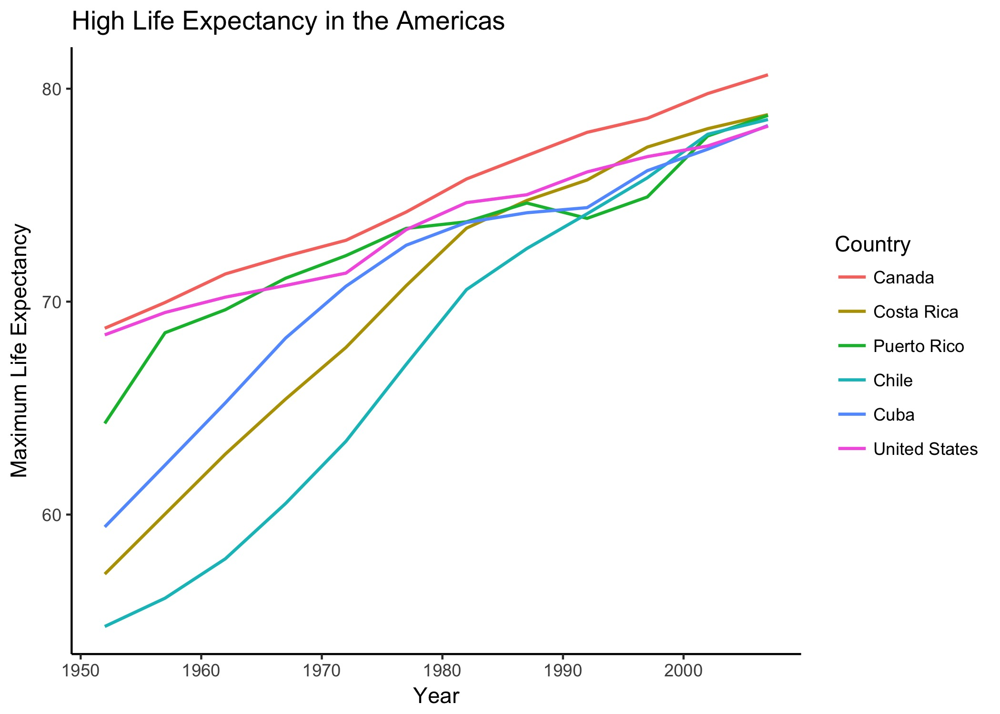

# Homework 5

## October 20th, 2017

Link to the STAT545 homework assignment page for [instructions](http://stat545.com/hw05_factor-figure-boss-repo-hygiene.html)

### Factor management

#### Libraries

**Load the necessary libraries**, with suppresed messages:

```{r Load libraries}
#suppress annoying start up message
suppressPackageStartupMessages(library(tidyverse))

#working with gapminder for this homework
library(gapminder)

#installed with tidyverse but needs to be loaded separately
library(forcats)
```

***

#### Filter

**Filter the gapminder data** to remove observations associated with the continent of Oceania:

```{r Drop Oceania} 
#filter data
newgap <- filter(gapminder, continent != "Oceania")

#check Oceania values
which(newgap$continent=="Oceania")

#check the levels
levels(newgap$continent)
```

Filter out Oceania, then check to see if it worked, we can see there are now 0 Oceania values but it remains a factor level.

Note: I assigned the filtered gapminder data to a new dataframe "newgap" for the comparisons between newgap and the original gapminder dataset and to write out the newgap data as its own file, which both occur later on in this assignment.

***

#### Factors

For now, let's **remove the unused factor level** Oceania:

```{r Drop levels}
#change to character
newgap$continent <- as.character(newgap$continent)

#change back to factor
newgap$continent <- as.factor(newgap$continent)

#check if it worked
levels(newgap$continent)
```

In my own data analysis I've dropped unusued levels by changing the factor to a character, where "Oceania" is not found and then changing it back to a factor to attain the new levels. But as with all data coding problems, there are other solutions that can be used, such as droplevels( ) or fct_drop( ).

***

#### Information

Provide concrete **information on the data** before and after removing these rows and Oceania; address the number of rows and the levels of the affected factors:

```{r Data info}
#how many rows in original
nrow(gapminder)

#how many rows once modified
nrow(newgap)

#how many rows were deleted
nrow(gapminder) - nrow(newgap)

#number of levels in original
nlevels(gapminder$continent)

#number of levels once modified
nlevels(newgap$continent)
```

Comparing the original and the filtered data we see that there are 24 rows of Oceania values that were removed. (And even though I could have mentally figured out that 1704-1680=24, I still decided to make R do the hard work for us!) Also we see that we went from 5 levels to 4, with the continents Americas, Asia, Africa and Europe remaining after the removal of Oceania.

***

#### Reorder

Reorder the levels of country or continent. Use the forcats package to change the order of the factor levels, based on a principled summary of one of the quantitative variables. Consider experimenting with a **summary statistic** beyond the most basic choice of the median:

```{r Summary statistic}
#find continents with max life exp. and put in numerical order
maxgap <- newgap %>%
  group_by(continent) %>%
  summarize(maxlife=max(lifeExp)) %>%
  arrange(desc(maxlife))

#make a table for the max life exp.
knitr::kable(maxgap, format="markdown")
```

I will **reorder my factors** according to which continents have the highest life expectancy, i.e. who lives the longest.

```{r Fix here}
#reorder levels
newgap$continent <- newgap$continent %>%
  fct_relevel("Asia", "Europe", "Americas", "Africa")

#double check!
levels(newgap$continent)
```

I've previously done factor reordering with this type of code:

`newgap$continent <- factor(newgap$continent, levels(newgap$continent)[c(3, 4, 2, 1)])`

to manually rearrange the levels, the numbers indicating the previous ordering, which is similar to the forcats way of rearranging levels but forcats is more easy and intuitive.

Also, an alternative to using the above table to find the needed factor levels is to use the code:

`fct_reorder(newgap$continent, newgap$lifeExp, max, .desc=TRUE) %>% levels()`

which prints the levels from highest to lowest maximum life expectancy, the same as the table does, but I found it difficult to assign the factor reordering back to the actual dataframe and it only prints out the levels with this specific code. Therefore I included the nice-looking table and this is just a side note on alternative ways to achieve things!

### File I/O

Experiment with one or more of write_csv( )/read_csv( ), saveRDS( )/readRDS( ),  dput( )/dget( ). Create something new, probably by filtering or grouped-summarization of ~~Singer or~~ Gapminder. It's highly recommend to fiddle with the factor levels, i.e. make them non-alphabetical (which I did above). Explore whether this survives the round trip of writing to file then reading back in:

```{r CSV files}
#write data out
write_csv(newgap, "newgap.csv")

#read data back in
newgap <- read_csv("newgap.csv")

#does it remain a factor variable?
is.factor(newgap$continent)

#change it to factor
newgap$continent <- as.factor(newgap$continent)

#check the levels
levels(newgap$continent)
```

I've chose not to put {r message=FALSE} here since the output message from read_csv tells us that continent is by default written as characters rather than as factors, which means we lost the reordering of the levels and it is alphabetical.

```{r RDS files}
#reorder levels again
newgap$continent <- newgap$continent %>%
  fct_relevel("Asia", "Europe", "Americas", "Africa")

#write/save to file
saveRDS(newgap, "newgap.rds")

#remove newgap to make sure it's gone
rm(newgap)

#read/open file
newgap <- readRDS("newgap.rds")

#is it a factor or character now?
class(newgap$continent)

#check the levels!
levels(newgap$continent)
```

We can see here that RDS does indeed retain the level order.

```{r TXT files}
#lets try one more! write out
dput(newgap, "newgap.txt")

#read back in
newgap <- dget("newgap.txt")

#check them levels
levels(newgap$continent)
```

Also, I attempted dput and dget, which keeps level order too!

### Visualization design

First we need to decide what to graph! Again, I'll focus on maximum life expectancy, investigating differences within the Americas.

```{r Data set-up}
#filter to Americas only, calculate max life exp
amgap <- newgap %>%
  filter(continent=="Americas") %>%
  group_by(country, year) %>%
  summarize(maxlife=max(lifeExp))

#find countries with highest max life exp
newmaxgap <- amgap %>%
  group_by(country) %>%
  filter(year==2007, maxlife>78)

#make a table of the above results
knitr::kable(newmaxgap, format = "markdown")
```

I'll be graphing the 6 highest max life expectancies and I decided on that because I wanted to include the US but it wasn't in the top 5!

```{r Initial graph}
#filter to relevant countries decided above
gap <- amgap %>%
  filter(country %in% newmaxgap$country)

#create initial plot
ggplot(gap, aes(year, maxlife))+
  geom_path(aes(colour=country))
```

We can see here that Canada and the US have been steadily increasing over time and other developing countries with originally lower values see a steeper increase in life expectancy and they "catch up" with our countries as they also become more developed, surpassing the US.

However, this initial graph can be improved with level reordering!

"Explore the effects of arrange( ).  
Does merely arranging the data have any effect on, say, a figure?"

```{r Arranged graph}
gap %>%
  arrange(desc(maxlife)) %>%
  ggplot(aes(year, maxlife))+
  geom_path(aes(color=country))
```

The answer is no! The graph colors are the same and now the lines even zig-zag in a strange way, this is not the right way to reorder!

```{r Reordered graph}
ggplot(gap, aes(year, maxlife))+
  geom_path(aes(color=fct_reorder2(country, year, maxlife)))+
  labs(color="country")
```

This is one of the ways to reorder factors right within ggplot! I find it more helpful to see the trends here. Let's improve more:

```{r Designed graph}
ggplot(gap, aes(year, maxlife))+
  geom_path(aes(color=fct_reorder2(country, year, maxlife)), size=0.75)+
  theme_classic()+
  labs(color="Country", title="High Life Expectancy in the Americas", x="Year", y="Maximum Life Expectancy")
```

The new improved graph! Now with:

* Factors reordered
* Thicker lines
* A classier theme
* Labels!

Note: I could have changed the colors, using for example:

`+scale_color_brewer(palette="Dark2")`

But I found the default colours to be visually pleasing.

Let me know what you think!

### Writing figures to file

Use ggsave( ) to explicitly save a plot to file, then load and embed it in your report and play around with various options:

```{r Figure JPG}
ggsave("high-life-exp-am.jpg")
```



Jpg's are raster files and are smaller files, useful for digital screen resolution, so can be used in emails, presentations, etc.

```{r Figure PDF}
ggsave("high-life-exp-am.pdf")
```


PDF's are a type of vector file format and is a larger file size and higher resolution so it can printed on a large poster and/or resized.

### Troubleshooting

I've decided to add this section to the Markdown file itself as per homework suggestions for simplicity and organization.

* How to suppress package start up messages
      + [Peer review!](https://github.com/vanflad/STAT545-hw-fladmark-vanessa/issues/4)
* Knitr::kable(data, format="markdown") reminder on syntax
      + [rdrr.io website](https://rdrr.io/cran/knitr/man/kable.html)
* Use of forcats for rearranging factor levels
      + STAT545 website - [be the boss of your factors](http://stat545.com/block029_factors.html)
* How to quote R code without running it
      + [R Markdown from RStudio](http://rmarkdown.rstudio.com/lesson-8.html)
* From the last link I also found how to do other fancy Markdown things! Such as how to insert breaks, lists, links, how to jump to headers, etc. This will likely be a really useful resource for the future!
      + [R Markdown Cheat Sheet](https://www.rstudio.com/wp-content/uploads/2016/03/rmarkdown-cheatsheet-2.0.pdf)
* How to write data out into a CSV file
      + STAT545 website - [Getting data in and out of R](http://stat545.com/block026_file-out-in.html)
* How to imbed an image in R Markdown file (I kept getting an error)
      + "Markdown Cheatsheet" someone made on [Github!](https://github.com/adam-p/markdown-here/wiki/Markdown-Cheatsheet)
      
I hope you enjoyed and understood my homework, I tried to maximize comments, clarity and organization here today!