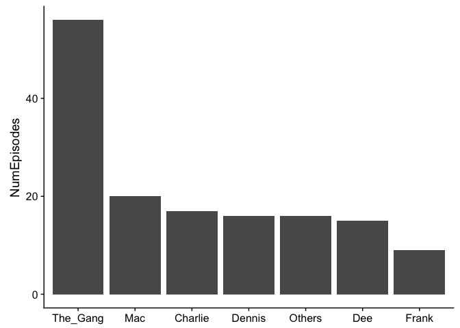
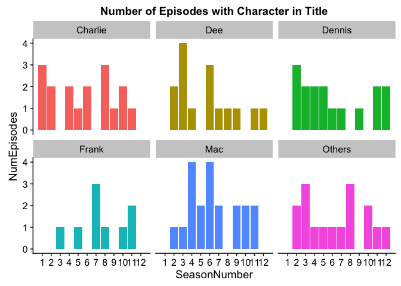
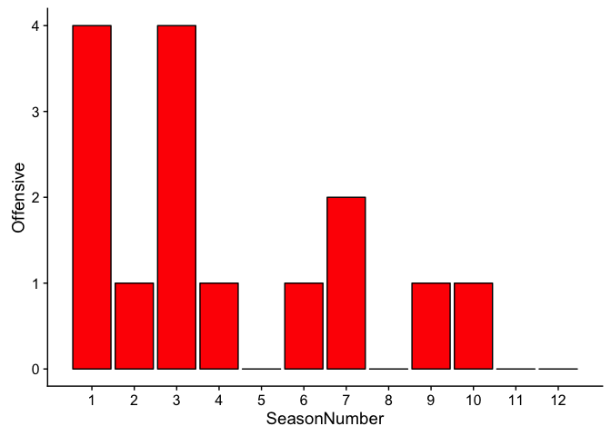
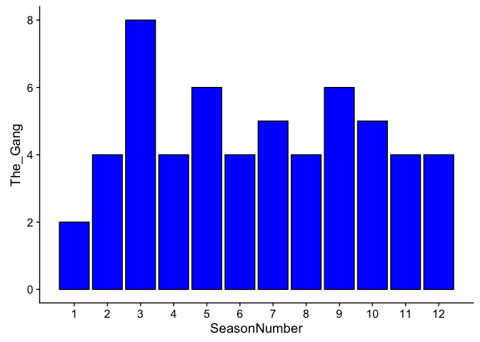

Homework 10
================
Vanessa Fladmark
December 7th, 2017

Getting Data from the Web
=========================

For this homework I will be making API queries "by hand" using the `httr` package. I first searched the [programmable web](https://www.programmableweb.com/category/movies/apis?category=20114), as recommended by the homework instructions on the [STAT 547](http://stat545.com/hw10_data-from-web.html) website to help narrow down my options. I found a link to [Internet Video Archive](https://developer.iva-api.com/) (IVA)'s Entertainment Express API, which utilizes a Demo Subscription that I obtained for free after signing up for their website. Reviewers may be able to replicate my code by using the same link with the relevant subscription key included in the code, though it maxes out at 1000 API requests and my code requires 134 requests and currently, I believe it can be ran approximately four more times maximum under my API rate limit, which (in theory) should be totally fine. If for whatever reason a peer reviewer accidentally downloads it five times, the solution would have to be to sign up to the website and replace my subscription key in the link with your relevant subscription key but that's a pain in the butt and why I've tried my best to make it work using this method first.

Troubleshooting note: I know these API rate limit details because I previously maxed it out while developing my code and trying to fix errors. The problem was that the function I was using to map over my dataframe was too fast compared to the slower `GET()` function that retrieves the data and I was getting five valid entries then a NULL, then five more entries, then a NULL and this pattern was repeated throughout my entire dataframe. I found a solution in a pacakge update description of [`httr`](https://blog.rstudio.com/2016/07/05/httr-1-2-0/), where the `RETRY()` function is similar to `GET()` but retries if unsuccessful the first few attempts, which was the perfect solution since I knew there were no errors in the descriptions on the website end. I then re-signed up for their site with another email. For simplicity's sake, I've included a plain [R script file](https://github.com/vanflad/STAT547-hw-fladmark-vanessa/blob/master/Homework%2010/Homework%2010.R) as well as this Markdown file (same code), for replicating my results.

The dataset that I will be retrieving from the web today is for the dark comedy Television Show on FXX, It's Always Sunny in Philadelphia! It will include a description of the show, seasons, episode numbers, episode titles, episode descriptions and some preliminary analysis on these, as well as the release dates.


Shown: (top) Dennis, (left to right) Charlie, Mac, and Dee, and (bottom) Frank.

First, let's load any needed libraries!

``` r
library(httr)
#for working with APIs
library(listviewer)
#for using jsonedit() to view lists
library(purrr)
#for using map() and working with lists
library(tidyverse)
```

    ## Loading tidyverse: ggplot2
    ## Loading tidyverse: tibble
    ## Loading tidyverse: tidyr
    ## Loading tidyverse: readr
    ## Loading tidyverse: dplyr

    ## Conflicts with tidy packages ----------------------------------------------

    ## filter(): dplyr, stats
    ## lag():    dplyr, stats

``` r
#data manipulation and graphs, as always
library(stringr)
#for working with strings
library(cowplot)
```

    ## 
    ## Attaching package: 'cowplot'

    ## The following object is masked from 'package:ggplot2':
    ## 
    ##     ggsave

``` r
#creates nice plot defaults
library(varhandle)
#for using unfactor() on numeric data
library(forcats)
#for level reordering
```

Now, load in the first batch of data and take a look and massage it into nicer a dataframe form compared to what the API provides:

``` r
sunny <- GET("https://ee.iva-api.com/Shows/2472?Includes=Genres&Includes=Descriptions&Includes=Seasons&subscription-Key=e0e7cacce3d246978c4d4d2bf9f0de54")
#retrieve the first large dataset of show description and episode titles by season

iasip <- as.list(content(sunny, as="parsed"))
#extract the raw content as something we can view

#jsonedit(iasip)    #edited out of r markdown file because can't view outside of RStudio
#view it, get familiar with how to best extract relevant info

details <- iasip[["Descriptions"]]
#grab the descriptions from the list

details[[1]]$Description
```

    ## [1] "Four friends in their late 20s with clear sociopathic tendencies who run Paddy's Pub, an unsuccessful Irish bar in South Philadelphia. "

``` r
#print out description 1, short version of what the show is about

details[[2]]$Description
```

    ## [1] "It's Always Sunny in Philadelphia is an American comedy series about four friends in their late 20s with clear sociopathic tendencies who run an unsuccessful Irish bar, \"Paddy's Pub,\" in South Philadelphia. The series deals with a variety of controversial topics, including abortion, gun control, physical disabilities, racism, sexism, religion, the Israeli/Palestinian situation, terrorism, transsexuality, slavery, incest, sexual harassment in education, the homeless, statutory rape, drug addiction, pedophilia, child abuse, mental illness, gay rights and dumpster babies. "

``` r
#print out longer description, describing the show and some of the crazy topics
```

While this doesn't sound like a playful sitcom full of light-hearted laughs, this dark comedy for people with twisted senses of humour really addresses head-on the taboo issues in society in an unapologetic and engaging way that brings these issues to the forefront of people's minds, rather than remaining hidden. The main reason that I've chosen my favourite *weird* show over a more vanilla show like Friends (partly because I find Sunny infinitely more interesting), is that I want to match up these controversial words/topics to episode descriptions and see if the show's offensive-ness has changed over time. Is it more tame? Or even more crazy?!

``` r
seasons <- iasip[["Seasons"]]
#extract seasons so we can then get all the episode titles

#jsonedit(seasons)  #edited out of r markdown file because can't view outside of RStudio
#view the list to see where to extract episode titles

Id <- vector()
EpisodeNumber <- vector()
SeasonNumber <- vector()
OriginalTitle <- vector()
Title <- vector()
OriginalReleaseDate <- vector()
Year <- vector()
sun <- rbind(Id, EpisodeNumber, SeasonNumber, OriginalTitle, Title,
                                        OriginalReleaseDate, Year)
bind <- data.frame()
#create empty vectors and dataframes for the for loop below

for (i in 1:12) {
    for(j in 1:length(seasons[[i]]$Episodes)){
        Id[j] <- seasons[[i]]$Episodes[[j]]$Id
        EpisodeNumber[j] <- seasons[[i]]$Episodes[[j]]$EpisodeNumber
        SeasonNumber[j] <- seasons[[i]]$Episodes[[j]]$SeasonNumber
        OriginalTitle[j] <- seasons[[i]]$Episodes[[j]]$OriginalTitle
        Title[j] <- seasons[[i]]$Episodes[[j]]$Title
        OriginalReleaseDate[j] <- seasons[[i]]$Episodes[[j]]$OriginalReleaseDate
        Year[j] <- seasons[[i]]$Episodes[[j]]$Year
    }
    bind <- rbind(Id, EpisodeNumber, SeasonNumber, OriginalTitle, Title,
                                        OriginalReleaseDate, Year)
    sun <- cbind(sun, bind)
    #for every season i and every episode j in each season, get Id, episode, title and date info
    Id <- vector()
    EpisodeNumber <- vector()
    SeasonNumber <- vector()
    OriginalTitle <- vector()
    Title <- vector()
    OriginalReleaseDate <- vector()
    Year <- vector()
    #reset vectors to empty before repeating because seasons have different number of episodes
    #otherwise later episodes from longer seasons will be repeated in the final dataframe
}

descrip <- function(Id){
    link <- paste("https://ee.iva-api.com/Shows/Seasons/Episodes/", Id, "?Includes=Descriptions&subscription-Key=e0e7cacce3d246978c4d4d2bf9f0de54", sep = "")
    ep <- RETRY("GET", link)
    episodes <- as.list(content(ep, as="parsed"))
    episodes$Descriptions[[1]]$Description
}
#create function to retrieve episode description info for each episode according to Id

reversed <- t(sun)
#flip rows and columns of dataframe created by the loop

tail(reversed)
```

    ##        Id        EpisodeNumber SeasonNumber
    ## [128,] "542253"  "5"           "12"        
    ## [129,] "542254"  "6"           "12"        
    ## [130,] "542255"  "7"           "12"        
    ## [131,] "542256"  "8"           "12"        
    ## [132,] "667368"  "9"           "12"        
    ## [133,] "1543252" "10"          "12"        
    ##        OriginalTitle                      
    ## [128,] "Making Dennis Reynolds a Murderer"
    ## [129,] "Hero or Hate Crime?"              
    ## [130,] "PTSDee"                           
    ## [131,] "The Gang Tends Bar"               
    ## [132,] "A Cricket's Tale"                 
    ## [133,] "Dennis' Double Life"              
    ##        Title                               OriginalReleaseDate           
    ## [128,] "Making Dennis Reynolds a Murderer" "2017-02-01T00:00:00.0000000Z"
    ## [129,] "Hero or Hate Crime?"               "2017-02-08T00:00:00.0000000Z"
    ## [130,] "PTSDee"                            "2017-02-15T00:00:00.0000000Z"
    ## [131,] "The Gang Tends Bar"                "2017-02-22T00:00:00.0000000Z"
    ## [132,] "A Cricket's Tale"                  "2017-03-01T00:00:00.0000000Z"
    ## [133,] "Dennis' Double Life"               "2017-03-08T00:00:00.0000000Z"
    ##        Year  
    ## [128,] "2017"
    ## [129,] "2017"
    ## [130,] "2017"
    ## [131,] "2017"
    ## [132,] "2017"
    ## [133,] "2017"

``` r
#see if it worked correctly

new <- as.data.frame(reversed)
#since t() forces into a matrix, turn back into dataframe

new$Id <- as.character(new$Id)
#make sure Id is a character to be properly pasted into link for API retrieval

tail(new)
```

    ##          Id EpisodeNumber SeasonNumber                     OriginalTitle
    ## 128  542253             5           12 Making Dennis Reynolds a Murderer
    ## 129  542254             6           12               Hero or Hate Crime?
    ## 130  542255             7           12                            PTSDee
    ## 131  542256             8           12                The Gang Tends Bar
    ## 132  667368             9           12                  A Cricket's Tale
    ## 133 1543252            10           12               Dennis' Double Life
    ##                                 Title          OriginalReleaseDate Year
    ## 128 Making Dennis Reynolds a Murderer 2017-02-01T00:00:00.0000000Z 2017
    ## 129               Hero or Hate Crime? 2017-02-08T00:00:00.0000000Z 2017
    ## 130                            PTSDee 2017-02-15T00:00:00.0000000Z 2017
    ## 131                The Gang Tends Bar 2017-02-22T00:00:00.0000000Z 2017
    ## 132                  A Cricket's Tale 2017-03-01T00:00:00.0000000Z 2017
    ## 133               Dennis' Double Life 2017-03-08T00:00:00.0000000Z 2017

``` r
#see if it worked, everything looks great so far!

alwayssunny <- mutate(new, Description=map_chr(new$Id, descrip))
```

    ## Request failed [429]. Retrying in 1 seconds...
    ## Request failed [429]. Retrying in 1 seconds...
    ## Request failed [429]. Retrying in 1 seconds...
    ## Request failed [429]. Retrying in 1 seconds...
    ## Request failed [429]. Retrying in 1 seconds...
    ## Request failed [429]. Retrying in 1 seconds...
    ## Request failed [429]. Retrying in 1 seconds...
    ## Request failed [429]. Retrying in 1 seconds...
    ## Request failed [429]. Retrying in 1 seconds...
    ## Request failed [429]. Retrying in 1 seconds...
    ## Request failed [429]. Retrying in 1 seconds...
    ## Request failed [429]. Retrying in 1 seconds...
    ## Request failed [429]. Retrying in 1 seconds...
    ## Request failed [429]. Retrying in 1 seconds...
    ## Request failed [429]. Retrying in 1 seconds...
    ## Request failed [429]. Retrying in 1 seconds...
    ## Request failed [429]. Retrying in 1 seconds...
    ## Request failed [429]. Retrying in 1 seconds...
    ## Request failed [429]. Retrying in 1 seconds...
    ## Request failed [429]. Retrying in 1 seconds...
    ## Request failed [429]. Retrying in 1 seconds...
    ## Request failed [429]. Retrying in 1 seconds...
    ## Request failed [429]. Retrying in 1 seconds...
    ## Request failed [429]. Retrying in 1 seconds...
    ## Request failed [429]. Retrying in 1 seconds...

``` r
#map the get-episode-info function across dataframe for each episode!

#only work "downstream" from here!* (i.e. don't unnecessarily re-download it all!)#

tail(alwayssunny$Description)
```

    ## [1] "An episode filmed in the true crime style of Making a Murderer and The Jinx: A cat-woman formerly known as Maureen Ponderosa has been found dead in an alley and Dennis is the prime suspect."                     
    ## [2] "The gang goes to a professional arbitrator to decide who's the rightful owner of a scratch off lottery ticket."                                                                                                    
    ## [3] "After finding out she's a male stripper's \"rock bottom,\" Dee goes on a mission to prove she's the best thing that ever happened to him."                                                                         
    ## [4] "Valentine's Day and Paddy's is packed with customers. Dennis implores the gang to do one day of actual work but everyone else is distracted by a mystery crate Cricket spotted in the alley."                      
    ## [5] "We get to see a typical day in Cricket's world and then a possible redemption when his family intervenes. Will Cricket finally move on from the gang, finding love in the process?"                                
    ## [6] "Dennis reveals he has a baby from his Wade Boggs layover in North Dakota. Everyone offers a solution for how to get him out of this jam. In the end, Dennis has to decide which life he wants to continue to lead."

``` r
#see if it worked, cool it did!
```

A huge chunk of data wrangling and manipulation later and we have finally arrived at a decent inital dataframe to start working with! Let's improve it further:

``` r
alwayssunny$OriginalReleaseDate <- as.character(alwayssunny$OriginalReleaseDate)
#change from factor to character to strip away all those zeros

split <- str_split_fixed(alwayssunny$OriginalReleaseDate, "T0", 2)
#split up into two columns, one for relevant date info, one for all the zeros

Date <- split[, 1]
#keep only the date info and save as vector named Date

philly <- cbind(alwayssunny, Date)
#combine back onto dataframe

which(philly$OriginalTitle != philly$Title)
```

    ## integer(0)

``` r
#see if any of the titles have changed since being released

philly <- select(philly, -OriginalReleaseDate, -OriginalTitle)
#drop release date since we've updated it, drop orig. title since same as title

tail(philly)
```

    ##          Id EpisodeNumber SeasonNumber                             Title
    ## 128  542253             5           12 Making Dennis Reynolds a Murderer
    ## 129  542254             6           12               Hero or Hate Crime?
    ## 130  542255             7           12                            PTSDee
    ## 131  542256             8           12                The Gang Tends Bar
    ## 132  667368             9           12                  A Cricket's Tale
    ## 133 1543252            10           12               Dennis' Double Life
    ##     Year
    ## 128 2017
    ## 129 2017
    ## 130 2017
    ## 131 2017
    ## 132 2017
    ## 133 2017
    ##                                                                                                                                                                                                            Description
    ## 128                      An episode filmed in the true crime style of Making a Murderer and The Jinx: A cat-woman formerly known as Maureen Ponderosa has been found dead in an alley and Dennis is the prime suspect.
    ## 129                                                                                                     The gang goes to a professional arbitrator to decide who's the rightful owner of a scratch off lottery ticket.
    ## 130                                                                            After finding out she's a male stripper's "rock bottom," Dee goes on a mission to prove she's the best thing that ever happened to him.
    ## 131                       Valentine's Day and Paddy's is packed with customers. Dennis implores the gang to do one day of actual work but everyone else is distracted by a mystery crate Cricket spotted in the alley.
    ## 132                                 We get to see a typical day in Cricket's world and then a possible redemption when his family intervenes. Will Cricket finally move on from the gang, finding love in the process?
    ## 133 Dennis reveals he has a baby from his Wade Boggs layover in North Dakota. Everyone offers a solution for how to get him out of this jam. In the end, Dennis has to decide which life he wants to continue to lead.
    ##           Date
    ## 128 2017-02-01
    ## 129 2017-02-08
    ## 130 2017-02-15
    ## 131 2017-02-22
    ## 132 2017-03-01
    ## 133 2017-03-08

``` r
#see how everything looks, so far, so good!

philly$Title <- as.character(philly$Title)
#change to character variable to find which episodes focus on specific characters

Charlie <- str_detect(philly$Title, "Charlie")
#find all episodes focused on Charlie
Dennis <- str_detect(philly$Title, paste(c("Dennis", "D.E.N.N.I.S."), collapse = "|"))
#find all episodes focused on Dennis, including The D.E.N.N.I.S System episode
Mac <- str_detect(philly$Title, "Mac")
#find all episodes focused on Mac
Dee <- str_detect(philly$Title, paste(c("Dee", "Aluminum Monster"), collapse = "|"))
#find all episodes focused on Dee, including The Aluminum Monster vs. Fatty Magoo, since Dee == Aluminum Monster
Frank <- str_detect(philly$Title, "Frank")
#find all episodes focused on Frank 
The_Gang <- str_detect(philly$Title, paste(c("The Gang", "Reynolds", "Chardee MacDennis", "Paddy's"),
                                                                                     collapse = "|"))
#find all episodes focused on the five main characters as a group, when referenced as the gang or reynolds (dee, dennis and frank's family last name)
#and including episodes centered around Paddy's Pub where they work and chardee macdennis a game they play, named after themselves
Others <- str_detect(philly$Title, paste(c("Waitress", "Cricket", "Ponderosa", "Mom", "Brother", "Pop-Pop", "Pete", "Dad", "Fatty Magoo", "Bums"), collapse = "|"))
#find all episodes focused on non-central characters because I'm curious to see how often these occur!

characters <- cbind(Charlie, Mac, Dennis, Dee, Frank, The_Gang, Others)
#combine vectors into a dataframe!

characters <- as.data.frame(characters)
#it was coerced into a character matrix so now it's a real dataframe

for (i in 1:ncol(characters)) {
    characters[, i][which(characters[, i]==TRUE)] <- 1
    characters[, i][which(characters[, i]==FALSE)] <- 0
}
#change TRUE and FALSE to 1's and 0's so we can count how many episodes each character has

chartable <- characters %>%
    summarise(Charlie = sum(Charlie), Mac = sum(Mac), Dennis = sum(Dennis), Dee = sum(Dee),
                        Frank = sum(Frank), The_Gang = sum(The_Gang), Others = sum(Others))
#sum up all the totals

knitr::kable(chartable, format = "markdown")
```

|  Charlie|  Mac|  Dennis|  Dee|  Frank|  The\_Gang|  Others|
|--------:|----:|-------:|----:|------:|----------:|-------:|
|       17|   20|      16|   15|      9|         56|      16|

``` r
#print out as a table
```

Okay, now into the good stuff of the assignment, the preliminary results! We see from the episode titles that Charlie, Mac, Dennis and Dee are the four main characters with Mac appearing to be the favourite (the actors who play Mac and Dennis are also writers on the show), "other" recurring characters play an important role, Frank (the patriarch of this misfit group, played by Danny Devito) has very few dedicated episodes and the episodes mainly focus on "The Gang" as an ensemble.

``` r
charplot <- gather(chartable, "Characters", "NumEpisodes")
#gather to plot a histogram of same data presented in table

charplot$Characters <- as.factor(charplot$Characters)
#change to factor to make bars in bar chart in descending order

ggplot(charplot, aes(fct_reorder(Characters, NumEpisodes, .desc = TRUE), NumEpisodes))+
    geom_bar(stat = "identity")+
    labs(x=NULL)
```



``` r
#plot of which characters come up most frequently in episode titles
```

A visualization of the same information given above in the table, in the form of a frequency histogram. Some comments on interpretation of the trends are that these numbers align with what makes sense to me as a viewer of the show, because the hilarious dynamic between The Gang is what makes it so enjoyable, they all make fun of each other and the show is at its best when incorporating all of its haywire characters. Dee is the lowest out of the four main characters because they love to make fun of her especially, always calling her a bird and being really mean (as they are to everyone), so there is less of a focus on her since The Gang often derails whatever she's up to and makes it about them - i.e. stealing her car and crashing it, on numerous occasions! And Frank is the lowest of all because as I've mentioned, viewers enjoy The Gang more, and if it's Frank heavy, then there's less of The Gang. Also, Danny Devito does an amazing job at really playing up the gross angle in this show, he once covered himself in purell head to toe and slid around like a slug, and it's hilarious but it's **too much**, a lot of the time.

``` r
details[[2]]$Description
```

    ## [1] "It's Always Sunny in Philadelphia is an American comedy series about four friends in their late 20s with clear sociopathic tendencies who run an unsuccessful Irish bar, \"Paddy's Pub,\" in South Philadelphia. The series deals with a variety of controversial topics, including abortion, gun control, physical disabilities, racism, sexism, religion, the Israeli/Palestinian situation, terrorism, transsexuality, slavery, incest, sexual harassment in education, the homeless, statutory rape, drug addiction, pedophilia, child abuse, mental illness, gay rights and dumpster babies. "

``` r
#print description again, the second half is how we will determine whether an episode is on an offensive topic

badwords <- str_split_fixed(details[[2]]$Description, "including", 2)
#split into two main chunks, the second one is the one we want here

badwords <- badwords[, 2]
#ditch the first half of that description chunk

badwords <- str_split(badwords, paste(c(",", "\\.", "and", "the", "physical"), collapse = "|"))
#split up by comma, get rid of any words like "and" or "the" and eliminate period from the end
#also, I put "physical" here because I wanted to drop it from "physical disabilities" (too long)

controversy <- as.data.frame(badwords[[1]])
#change from a list to a dataframe
colnames(controversy) <- "words"
#change the column name to something I can reference more easily
controversy$words <- as.character(controversy$words)
#change from factor to character (why is factor always the default?! *curses the skies*)

controversy <- str_split_fixed(controversy$words, " ", 2)
#split into two list items by first space to strip away space present before each entry
controversy <- controversy[, 2]
#keep only the second list item with words entries, drop empty one

controversy <- as.data.frame(controversy)
colnames(controversy) <- "words"
controversy$words <- as.character(controversy$words)
#because str_split always returns a list, repeat process as before
#i.e. remaking it a dataframe, renaming it, and making variables characters

controversy <- filter(controversy, words != "")
#filter out any empty values left over from string splitting
controversy <- str_split_fixed(controversy$words, " ", 2)
#split up multiple words into two list items (or two columns, as I visualize them)
controversy <- controversy[, 1]
#drop the second list item, only keeping the first word from each phrase

controversy <- as.data.frame(controversy)
colnames(controversy) <- "words"
controversy$words <- as.character(controversy$words)
#repeat list <- dataframe one last time (I know, next time I'll make a function!)

for (i in 1:nrow(controversy)) {
    controversy$words[i] <- str_trunc(controversy$words[i], width = 7, side = "right", ellipsis = "*")
}
#for each word, if longer than seven letters, truncate and add an asterix for easier matching!

controversy <- as.vector(controversy[, 1])
#change to a vector to be pasted together to find matches to episode descriptions

Offensive <- str_detect(philly$Description, str_c(controversy, collapse = "|"))
#find matches between controversial topics and episode descriptions

length(which(Offensive==TRUE))
```

    ## [1] 15

``` r
#there are fifteen (out of 133) terribly offensive episodes!

which(Offensive==TRUE)
```

    ##  [1]   1   2   4   5   9  18  26  27  28  34  70  72  73  95 106

``` r
#it seems they are earlier in the show's history but we'll see in a plot as well

for (i in 1:length(Offensive)) {
    Offensive[i][which(Offensive[i]==TRUE)] <- 1
    Offensive[i][which(Offensive[i]==FALSE)] <- 0
}
#change TRUE and FALSE to 1's and 0's for offensive category episodes as well

always <- cbind(philly, characters, Offensive)
#combine dataframes with season info, character in title data, and offensive data

always$SeasonNumber <- unfactor(always$SeasonNumber)
#change from factor to numeric without the numbers acting weird like they do with `as.numeric(factor)`

write_csv(always, "alwayssunny.csv")
#write new dataframe to file to save!
```

For this final assignment, I've decided to incorporate the troubleshooting into where it's relevant to the code in the Rmd file, rather than at the end of the Rmd or only in the README on Github. I would therefore like to link to the relevant [Stack Overflow](https://stackoverflow.com/questions/3418128/how-to-convert-a-factor-to-an-integer-numeric-without-a-loss-of-information) question that I found when I was trying to figure out why the season numbers were jumping all over the place when attempting to use `as.numeric(always$SeasonNumber)` to convert a factor variable.

Now that we've found all the offensive and non-offensive episodes and gotten the data on characters appearing in episode titles, it has been combined into one big neat and tidy dataframe named `always`, which I've also saved to file as `alwayssunny.csv` to play around with later when I will eventually need an R refresh!

Next, create plots and see how these character and offensive variables change over the course of the show from 2005 to 2017 over 12 seasons (with at least 2 more seasons on the way!)

``` r
seasonsums <- always %>%
    group_by(SeasonNumber) %>%
    summarise(Charlie = sum(Charlie), Mac = sum(Mac), Dennis = sum(Dennis), Dee = sum(Dee),
                        Frank = sum(Frank), The_Gang = sum(The_Gang), Others = sum(Others), Offensive = sum(Offensive)) %>%
    gather(MainCharacters, NumEpisodes, Charlie:Frank, Others)
#get data for each season, summarizing all necessary character info

ggplot(seasonsums, aes(SeasonNumber, NumEpisodes))+
    geom_bar(aes(fill=MainCharacters), stat = "identity")+
    facet_wrap(~MainCharacters)+
    scale_x_continuous(breaks = seq(1:12))+
    theme(legend.position = "none")+
    ggtitle("Number of Episodes with Character in Title")
```



``` r
#plot of how frequently a character has a title episode and how it changed over time
```

Very cool plot of how the dynamics have shifted and re-shifted towards certain characters and away from different characters then vice versa, depending on the story arcs of any given season. Some appear to be decreasing and this may be a result of the show gaining complexity and more characters, whereas in the first few seasons it was focused on a few people and stories had to center around them to develop the characters and their personalities. Whereas, now that it's later on in the show and their budget has increased from what it once was, The Gang gets into more interesting situations, outside of the Paddy's Pub bar and drama focused story. Although I will say that I am happy to see that Charlie Kelly consistently has multiple Charlie-centric episodes, as his absurdity never fails to entertain!

``` r
ggplot(always, aes(SeasonNumber, Offensive))+
    stat_summary(fun.y = sum, geom = "bar", fill = "red", color = "black")+
    scale_x_continuous(breaks = seq(1:12))
```



``` r
#simple bar chart of how the frequency of offensive episodes has decreased over time
```

The appearance of offensive topic episodes appears fairly consistently to have at least one episode throughout the seasons, with exceptions, including the last two seasons which seem to be more on the tame side. Season 1 & 3 are determined to be the most offensive and I believe that this makes sense, since season 1 is our first introduction to these insane characters and the show starts off strong on controversial topics, asserting itself as not-another-sitcom. When they were looking at renewal for a second season, the TV network FX told the show it needed a big name star (Danny Devito) to be introduced to get more viewers and so this season they're figuring out the new dynamic of The Gang, is Frank the straight man or is he even more insane than the rest of the characters? Therefore season 2 was more focused on story and less on controversial topics, whereas season 3, the dynamic is established and they can resume their ultimately crazy shenanigans. In my opinion, season 4 is where the show really picks up and manages to finds the balance between absurdity/boudary pushing and comedy gold, where it is no longer trying to be as ridiculous as possible but it's still wacky enough to be entertaining and original.

``` r
ggplot(always, aes(SeasonNumber, The_Gang))+
    stat_summary(fun.y = sum, geom = "bar", fill = "blue", color = "black")+
    scale_x_continuous(breaks = seq(1:12))
```



``` r
#simple bar chart of how frequently episodes are focused on "The Gang" as a whole
```

The final graph shows the seasons in which "The Gang..." is most prominent in the episode titles. Now, if you're finishing up this review and thinking wow what a weird person for choosing a TV show so outrageous for an assignment, that's fair, but I wouldn't have gone as in-depth into something like the Simpsons. *But* if you're **also** a little dark and wacky like me and you're thinking "hmm, maybe I should see what all the hype is about for the longest running live-action show on television?" I would love to recommend that you watch It's Always Sunny in Philadelphia starting at Season 5, since the data shows that it's the best season to start with because 0/12 episodes are on offensive topics and there are 6 The Gang focused episodes, and it's also their strongest and most hilarious season.

Regardless of if you watch the show, here's at least a cute one minute clip from Season 5, Episode 8, where Charlie is selling [Kitten Mittens!!](https://www.youtube.com/watch?v=22O6Nmjt-mw)
