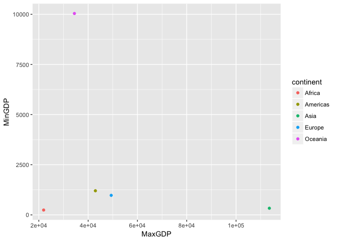
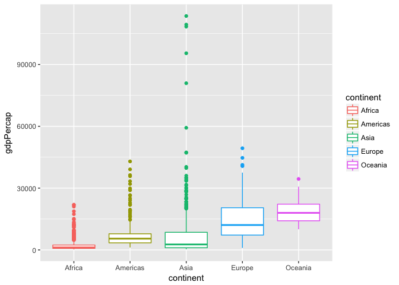
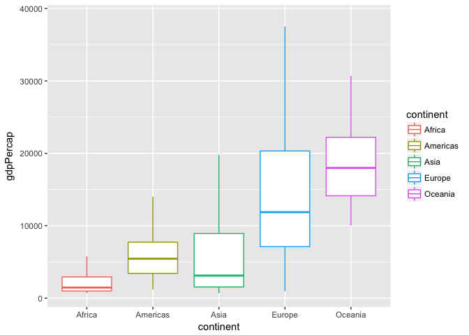
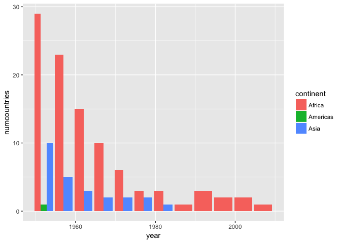

Homework 3
================

October 3rd, 2017
-----------------

### First, always have to load the relevant libraries!

``` r
library(tidyverse)
```

    ## Loading tidyverse: ggplot2
    ## Loading tidyverse: tibble
    ## Loading tidyverse: tidyr
    ## Loading tidyverse: readr
    ## Loading tidyverse: purrr
    ## Loading tidyverse: dplyr

    ## Conflicts with tidy packages ----------------------------------------------

    ## filter(): dplyr, stats
    ## lag():    dplyr, stats

``` r
library(gapminder)
```

### Maximum and minimum GDP per capita for all continents

``` r
a <- gapminder %>%
  group_by(continent) %>%
  summarize(MaxGDP=max(gdpPercap), MinGDP=round(min(gdpPercap), 2), DiffGDP=max(gdpPercap)-min(gdpPercap))
knitr::kable(a, format = "markdown")
```

| continent |     MaxGDP|    MinGDP|    DiffGDP|
|:----------|----------:|---------:|----------:|
| Africa    |   21951.21|    241.17|   21710.05|
| Americas  |   42951.65|   1201.64|   41750.02|
| Asia      |  113523.13|    331.00|  113192.13|
| Europe    |   49357.19|    973.53|   48383.66|
| Oceania   |   34435.37|  10039.60|   24395.77|

``` r
a %>%
  ggplot(aes(MaxGDP, MinGDP)) +
  geom_point(aes(color=continent))
```



We can see here that Asia has the biggest discrepancy between a low minimum GDP and a high maximum GDP (also shown in the table!), Africa has the lowest difference because they have the lowest minimum *and* maximum GDP and Oceania also has a small discrepancy in GDP, where they have a much higher minimum GDP than other areas.

### Spread of GDP per capita within the continents

``` r
b <- gapminder %>%
  group_by(continent) %>%
  summarize(GDP_IQR=IQR(gdpPercap),GDP_SD=sd(gdpPercap), GDP_median_dev=mad(gdpPercap))
knitr::kable(b, format = "markdown")
```

| continent |   GDP\_IQR|    GDP\_SD|  GDP\_median\_dev|
|:----------|----------:|----------:|-----------------:|
| Africa    |   1616.170|   2827.930|          775.3226|
| Americas  |   4402.431|   6396.764|         3269.3325|
| Asia      |   7492.262|  14045.373|         2820.8338|
| Europe    |  13248.301|   9355.213|         8846.0506|
| Oceania   |   8072.258|   6358.983|         6459.1033|

``` r
ggplot(gapminder, aes(continent, gdpPercap)) +
  geom_boxplot(aes(color=continent))
```



<style type="text/css">
.twoC {width: 100%}
.clearer {clear: both}
.twoC .table {max-width: 50%; float: right}
.twoC img {max-width: 50%; float: left}
</style>
A boxplot showing the spread described by the above table.

``` r
 ggplot(gapminder, aes(continent, gdpPercap)) +
  geom_boxplot(outlier.shape = NA, aes(color=continent))+
  scale_y_continuous(limits=quantile(gapminder$gdpPercap, c(0.1, 0.991)))
```

    ## Warning: Removed 187 rows containing non-finite values (stat_boxplot).



The same plot with extreme outliers removed to see the detail here.

### Countries with low life expectancy over time by continent

``` r
c <- gapminder %>%
  group_by(continent, year) %>%
  filter(lifeExp < 40) %>%
  summarize(numcountries=n_distinct(country))
knitr::kable(c, format="markdown")
```

| continent |  year|  numcountries|
|:----------|-----:|-------------:|
| Africa    |  1952|            29|
| Africa    |  1957|            23|
| Africa    |  1962|            15|
| Africa    |  1967|            10|
| Africa    |  1972|             6|
| Africa    |  1977|             3|
| Africa    |  1982|             3|
| Africa    |  1987|             1|
| Africa    |  1992|             3|
| Africa    |  1997|             2|
| Africa    |  2002|             2|
| Africa    |  2007|             1|
| Americas  |  1952|             1|
| Asia      |  1952|            10|
| Asia      |  1957|             5|
| Asia      |  1962|             3|
| Asia      |  1967|             2|
| Asia      |  1972|             2|
| Asia      |  1977|             2|
| Asia      |  1982|             1|

``` r
ggplot(c, aes(year, numcountries)) +
  geom_bar(aes(fill=continent), position="dodge", stat="identity")
```


