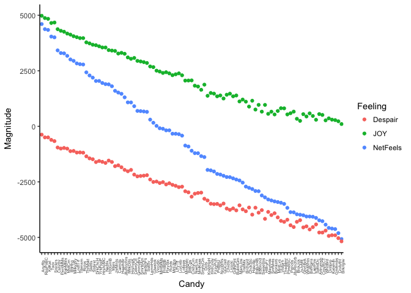

Homework 6
================
November 10th, 2017

Data wrangling wrap up
======================

Link to homework [instructions](http://stat545.com/hw06_data-wrangling-conclusion.html)

------------------------------------------------------------------------

Topic 5: Work with a list
-------------------------

Load in the `purrr` tutorial packages for data on Game of Thrones:

``` r
library(purrr)
library(repurrrsive)
```

### Exercise 1: `max.level`

Read the documentation on `str()`. What does `max.level` control? Apply `str()` to `wesanderson` and/or `got_chars` and experiment with `max.level = 0`, `max.level = 1`, and `max.level = 2`. Which will you use in practice with deeply nested lists?

According to `?str()` [documentation](https://stat.ethz.ch/R-manual/R-devel/library/utils/html/str.html) `max.level` is the:

> maximal level of nesting which is applied for displaying nested structures, e.g., a list containing sub lists. Default `NA`: Display all nesting levels.

``` r
str(got_chars, max.level = 0)
```

    ## List of 30

A simple-as-possible summary about the structure of this nested dataframe that includes data for 30 characters.

``` r
str(got_chars, max.level = 1)
```

    ## List of 30
    ##  $ :List of 18
    ##  $ :List of 18
    ##  $ :List of 18
    ##  $ :List of 18
    ##  $ :List of 18
    ##  $ :List of 18
    ##  $ :List of 18
    ##  $ :List of 18
    ##  $ :List of 18
    ##  $ :List of 18
    ##  $ :List of 18
    ##  $ :List of 18
    ##  $ :List of 18
    ##  $ :List of 18
    ##  $ :List of 18
    ##  $ :List of 18
    ##  $ :List of 18
    ##  $ :List of 18
    ##  $ :List of 18
    ##  $ :List of 18
    ##  $ :List of 18
    ##  $ :List of 18
    ##  $ :List of 18
    ##  $ :List of 18
    ##  $ :List of 18
    ##  $ :List of 18
    ##  $ :List of 18
    ##  $ :List of 18
    ##  $ :List of 18
    ##  $ :List of 18

Looking at the next level of the nested dataframe, it's shown that each character has 18 categories of information included in the data.

``` r
str(got_chars, max.level = 2)
```

    ## List of 30
    ##  $ :List of 18
    ##   ..$ url        : chr "https://www.anapioficeandfire.com/api/characters/1022"
    ##   ..$ id         : int 1022
    ##   ..$ name       : chr "Theon Greyjoy"
    ##   ..$ gender     : chr "Male"
    ##   ..$ culture    : chr "Ironborn"
    ##   ..$ born       : chr "In 278 AC or 279 AC, at Pyke"
    ##   ..$ died       : chr ""
    ##   ..$ alive      : logi TRUE
    ##   ..$ titles     : chr [1:3] "Prince of Winterfell" "Captain of Sea Bitch" "Lord of the Iron Islands (by law of the green lands)"
    ##   ..$ aliases    : chr [1:4] "Prince of Fools" "Theon Turncloak" "Reek" "Theon Kinslayer"
    ##   ..$ father     : chr ""
    ##   ..$ mother     : chr ""
    ##   ..$ spouse     : chr ""
    ##   ..$ allegiances: chr "House Greyjoy of Pyke"
    ##   ..$ books      : chr [1:3] "A Game of Thrones" "A Storm of Swords" "A Feast for Crows"
    ##   ..$ povBooks   : chr [1:2] "A Clash of Kings" "A Dance with Dragons"
    ##   ..$ tvSeries   : chr [1:6] "Season 1" "Season 2" "Season 3" "Season 4" ...
    ##   ..$ playedBy   : chr "Alfie Allen"
    ##  $ :List of 18
    ##   ..$ url        : chr "https://www.anapioficeandfire.com/api/characters/1052"
    ##   ..$ id         : int 1052
    ##   ..$ name       : chr "Tyrion Lannister"
    ##   ..$ gender     : chr "Male"
    ##   ..$ culture    : chr ""
    ##   ..$ born       : chr "In 273 AC, at Casterly Rock"
    ##   ..$ died       : chr ""
    ##   ..$ alive      : logi TRUE
    ##   ..$ titles     : chr [1:2] "Acting Hand of the King (former)" "Master of Coin (former)"
    ##   ..$ aliases    : chr [1:11] "The Imp" "Halfman" "The boyman" "Giant of Lannister" ...
    ##   ..$ father     : chr ""
    ##   ..$ mother     : chr ""
    ##   ..$ spouse     : chr "https://www.anapioficeandfire.com/api/characters/2044"
    ##   ..$ allegiances: chr "House Lannister of Casterly Rock"
    ##   ..$ books      : chr [1:2] "A Feast for Crows" "The World of Ice and Fire"
    ##   ..$ povBooks   : chr [1:4] "A Game of Thrones" "A Clash of Kings" "A Storm of Swords" "A Dance with Dragons"
    ##   ..$ tvSeries   : chr [1:6] "Season 1" "Season 2" "Season 3" "Season 4" ...
    ##   ..$ playedBy   : chr "Peter Dinklage"
    ##  $ :List of 18
    ##   ..$ url        : chr "https://www.anapioficeandfire.com/api/characters/1074"
    ##   ..$ id         : int 1074
    ##   ..$ name       : chr "Victarion Greyjoy"
    ##   ..$ gender     : chr "Male"
    ##   ..$ culture    : chr "Ironborn"
    ##   ..$ born       : chr "In 268 AC or before, at Pyke"
    ##   ..$ died       : chr ""
    ##   ..$ alive      : logi TRUE
    ##   ..$ titles     : chr [1:2] "Lord Captain of the Iron Fleet" "Master of the Iron Victory"
    ##   ..$ aliases    : chr "The Iron Captain"
    ##   ..$ father     : chr ""
    ##   ..$ mother     : chr ""
    ##   ..$ spouse     : chr ""
    ##   ..$ allegiances: chr "House Greyjoy of Pyke"
    ##   ..$ books      : chr [1:3] "A Game of Thrones" "A Clash of Kings" "A Storm of Swords"
    ##   ..$ povBooks   : chr [1:2] "A Feast for Crows" "A Dance with Dragons"
    ##   ..$ tvSeries   : chr ""
    ##   ..$ playedBy   : chr ""
    ##  $ :List of 18
    ##   ..$ url        : chr "https://www.anapioficeandfire.com/api/characters/1109"
    ##   ..$ id         : int 1109
    ##   ..$ name       : chr "Will"
    ##   ..$ gender     : chr "Male"
    ##   ..$ culture    : chr ""
    ##   ..$ born       : chr ""
    ##   ..$ died       : chr "In 297 AC, at Haunted Forest"
    ##   ..$ alive      : logi FALSE
    ##   ..$ titles     : chr ""
    ##   ..$ aliases    : chr ""
    ##   ..$ father     : chr ""
    ##   ..$ mother     : chr ""
    ##   ..$ spouse     : chr ""
    ##   ..$ allegiances: list()
    ##   ..$ books      : chr "A Clash of Kings"
    ##   ..$ povBooks   : chr "A Game of Thrones"
    ##   ..$ tvSeries   : chr ""
    ##   ..$ playedBy   : chr "Bronson Webb"
    ##  $ :List of 18
    ##   ..$ url        : chr "https://www.anapioficeandfire.com/api/characters/1166"
    ##   ..$ id         : int 1166
    ##   ..$ name       : chr "Areo Hotah"
    ##   ..$ gender     : chr "Male"
    ##   ..$ culture    : chr "Norvoshi"
    ##   ..$ born       : chr "In 257 AC or before, at Norvos"
    ##   ..$ died       : chr ""
    ##   ..$ alive      : logi TRUE
    ##   ..$ titles     : chr "Captain of the Guard at Sunspear"
    ##   ..$ aliases    : chr ""
    ##   ..$ father     : chr ""
    ##   ..$ mother     : chr ""
    ##   ..$ spouse     : chr ""
    ##   ..$ allegiances: chr "House Nymeros Martell of Sunspear"
    ##   ..$ books      : chr [1:3] "A Game of Thrones" "A Clash of Kings" "A Storm of Swords"
    ##   ..$ povBooks   : chr [1:2] "A Feast for Crows" "A Dance with Dragons"
    ##   ..$ tvSeries   : chr [1:2] "Season 5" "Season 6"
    ##   ..$ playedBy   : chr "DeObia Oparei"
    ##  $ :List of 18
    ##   ..$ url        : chr "https://www.anapioficeandfire.com/api/characters/1267"
    ##   ..$ id         : int 1267
    ##   ..$ name       : chr "Chett"
    ##   ..$ gender     : chr "Male"
    ##   ..$ culture    : chr ""
    ##   ..$ born       : chr "At Hag's Mire"
    ##   ..$ died       : chr "In 299 AC, at Fist of the First Men"
    ##   ..$ alive      : logi FALSE
    ##   ..$ titles     : chr ""
    ##   ..$ aliases    : chr ""
    ##   ..$ father     : chr ""
    ##   ..$ mother     : chr ""
    ##   ..$ spouse     : chr ""
    ##   ..$ allegiances: list()
    ##   ..$ books      : chr [1:2] "A Game of Thrones" "A Clash of Kings"
    ##   ..$ povBooks   : chr "A Storm of Swords"
    ##   ..$ tvSeries   : chr ""
    ##   ..$ playedBy   : chr ""
    ##  $ :List of 18
    ##   ..$ url        : chr "https://www.anapioficeandfire.com/api/characters/1295"
    ##   ..$ id         : int 1295
    ##   ..$ name       : chr "Cressen"
    ##   ..$ gender     : chr "Male"
    ##   ..$ culture    : chr ""
    ##   ..$ born       : chr "In 219 AC or 220 AC"
    ##   ..$ died       : chr "In 299 AC, at Dragonstone"
    ##   ..$ alive      : logi FALSE
    ##   ..$ titles     : chr "Maester"
    ##   ..$ aliases    : chr ""
    ##   ..$ father     : chr ""
    ##   ..$ mother     : chr ""
    ##   ..$ spouse     : chr ""
    ##   ..$ allegiances: list()
    ##   ..$ books      : chr [1:2] "A Storm of Swords" "A Feast for Crows"
    ##   ..$ povBooks   : chr "A Clash of Kings"
    ##   ..$ tvSeries   : chr "Season 2"
    ##   ..$ playedBy   : chr "Oliver Ford"
    ##  $ :List of 18
    ##   ..$ url        : chr "https://www.anapioficeandfire.com/api/characters/130"
    ##   ..$ id         : int 130
    ##   ..$ name       : chr "Arianne Martell"
    ##   ..$ gender     : chr "Female"
    ##   ..$ culture    : chr "Dornish"
    ##   ..$ born       : chr "In 276 AC, at Sunspear"
    ##   ..$ died       : chr ""
    ##   ..$ alive      : logi TRUE
    ##   ..$ titles     : chr "Princess of Dorne"
    ##   ..$ aliases    : chr ""
    ##   ..$ father     : chr ""
    ##   ..$ mother     : chr ""
    ##   ..$ spouse     : chr ""
    ##   ..$ allegiances: chr "House Nymeros Martell of Sunspear"
    ##   ..$ books      : chr [1:4] "A Game of Thrones" "A Clash of Kings" "A Storm of Swords" "A Dance with Dragons"
    ##   ..$ povBooks   : chr "A Feast for Crows"
    ##   ..$ tvSeries   : chr ""
    ##   ..$ playedBy   : chr ""
    ##  $ :List of 18
    ##   ..$ url        : chr "https://www.anapioficeandfire.com/api/characters/1303"
    ##   ..$ id         : int 1303
    ##   ..$ name       : chr "Daenerys Targaryen"
    ##   ..$ gender     : chr "Female"
    ##   ..$ culture    : chr "Valyrian"
    ##   ..$ born       : chr "In 284 AC, at Dragonstone"
    ##   ..$ died       : chr ""
    ##   ..$ alive      : logi TRUE
    ##   ..$ titles     : chr [1:5] "Queen of the Andals and the Rhoynar and the First Men, Lord of the Seven Kingdoms" "Khaleesi of the Great Grass Sea" "Breaker of Shackles/Chains" "Queen of Meereen" ...
    ##   ..$ aliases    : chr [1:11] "Dany" "Daenerys Stormborn" "The Unburnt" "Mother of Dragons" ...
    ##   ..$ father     : chr ""
    ##   ..$ mother     : chr ""
    ##   ..$ spouse     : chr "https://www.anapioficeandfire.com/api/characters/1346"
    ##   ..$ allegiances: chr "House Targaryen of King's Landing"
    ##   ..$ books      : chr "A Feast for Crows"
    ##   ..$ povBooks   : chr [1:4] "A Game of Thrones" "A Clash of Kings" "A Storm of Swords" "A Dance with Dragons"
    ##   ..$ tvSeries   : chr [1:6] "Season 1" "Season 2" "Season 3" "Season 4" ...
    ##   ..$ playedBy   : chr "Emilia Clarke"
    ##  $ :List of 18
    ##   ..$ url        : chr "https://www.anapioficeandfire.com/api/characters/1319"
    ##   ..$ id         : int 1319
    ##   ..$ name       : chr "Davos Seaworth"
    ##   ..$ gender     : chr "Male"
    ##   ..$ culture    : chr "Westeros"
    ##   ..$ born       : chr "In 260 AC or before, at King's Landing"
    ##   ..$ died       : chr ""
    ##   ..$ alive      : logi TRUE
    ##   ..$ titles     : chr [1:4] "Ser" "Lord of the Rainwood" "Admiral of the Narrow Sea" "Hand of the King"
    ##   ..$ aliases    : chr [1:5] "Onion Knight" "Davos Shorthand" "Ser Onions" "Onion Lord" ...
    ##   ..$ father     : chr ""
    ##   ..$ mother     : chr ""
    ##   ..$ spouse     : chr "https://www.anapioficeandfire.com/api/characters/1676"
    ##   ..$ allegiances: chr [1:2] "House Baratheon of Dragonstone" "House Seaworth of Cape Wrath"
    ##   ..$ books      : chr "A Feast for Crows"
    ##   ..$ povBooks   : chr [1:3] "A Clash of Kings" "A Storm of Swords" "A Dance with Dragons"
    ##   ..$ tvSeries   : chr [1:5] "Season 2" "Season 3" "Season 4" "Season 5" ...
    ##   ..$ playedBy   : chr "Liam Cunningham"
    ##  $ :List of 18
    ##   ..$ url        : chr "https://www.anapioficeandfire.com/api/characters/148"
    ##   ..$ id         : int 148
    ##   ..$ name       : chr "Arya Stark"
    ##   ..$ gender     : chr "Female"
    ##   ..$ culture    : chr "Northmen"
    ##   ..$ born       : chr "In 289 AC, at Winterfell"
    ##   ..$ died       : chr ""
    ##   ..$ alive      : logi TRUE
    ##   ..$ titles     : chr "Princess"
    ##   ..$ aliases    : chr [1:16] "Arya Horseface" "Arya Underfoot" "Arry" "Lumpyface" ...
    ##   ..$ father     : chr ""
    ##   ..$ mother     : chr ""
    ##   ..$ spouse     : chr ""
    ##   ..$ allegiances: chr "House Stark of Winterfell"
    ##   ..$ books      : list()
    ##   ..$ povBooks   : chr [1:5] "A Game of Thrones" "A Clash of Kings" "A Storm of Swords" "A Feast for Crows" ...
    ##   ..$ tvSeries   : chr [1:6] "Season 1" "Season 2" "Season 3" "Season 4" ...
    ##   ..$ playedBy   : chr "Maisie Williams"
    ##  $ :List of 18
    ##   ..$ url        : chr "https://www.anapioficeandfire.com/api/characters/149"
    ##   ..$ id         : int 149
    ##   ..$ name       : chr "Arys Oakheart"
    ##   ..$ gender     : chr "Male"
    ##   ..$ culture    : chr "Reach"
    ##   ..$ born       : chr "At Old Oak"
    ##   ..$ died       : chr "In 300 AC, at the Greenblood"
    ##   ..$ alive      : logi FALSE
    ##   ..$ titles     : chr "Ser"
    ##   ..$ aliases    : chr ""
    ##   ..$ father     : chr ""
    ##   ..$ mother     : chr ""
    ##   ..$ spouse     : chr ""
    ##   ..$ allegiances: chr "House Oakheart of Old Oak"
    ##   ..$ books      : chr [1:4] "A Game of Thrones" "A Clash of Kings" "A Storm of Swords" "A Dance with Dragons"
    ##   ..$ povBooks   : chr "A Feast for Crows"
    ##   ..$ tvSeries   : chr ""
    ##   ..$ playedBy   : chr ""
    ##  $ :List of 18
    ##   ..$ url        : chr "https://www.anapioficeandfire.com/api/characters/150"
    ##   ..$ id         : int 150
    ##   ..$ name       : chr "Asha Greyjoy"
    ##   ..$ gender     : chr "Female"
    ##   ..$ culture    : chr "Ironborn"
    ##   ..$ born       : chr "In 275 AC or 276 AC, at Pyke"
    ##   ..$ died       : chr ""
    ##   ..$ alive      : logi TRUE
    ##   ..$ titles     : chr [1:3] "Princess" "Captain of the Black Wind" "Conqueror of Deepwood Motte"
    ##   ..$ aliases    : chr [1:2] "Esgred" "The Kraken's Daughter"
    ##   ..$ father     : chr ""
    ##   ..$ mother     : chr ""
    ##   ..$ spouse     : chr "https://www.anapioficeandfire.com/api/characters/1372"
    ##   ..$ allegiances: chr [1:2] "House Greyjoy of Pyke" "House Ironmaker"
    ##   ..$ books      : chr [1:2] "A Game of Thrones" "A Clash of Kings"
    ##   ..$ povBooks   : chr [1:2] "A Feast for Crows" "A Dance with Dragons"
    ##   ..$ tvSeries   : chr [1:3] "Season 2" "Season 3" "Season 4"
    ##   ..$ playedBy   : chr "Gemma Whelan"
    ##  $ :List of 18
    ##   ..$ url        : chr "https://www.anapioficeandfire.com/api/characters/168"
    ##   ..$ id         : int 168
    ##   ..$ name       : chr "Barristan Selmy"
    ##   ..$ gender     : chr "Male"
    ##   ..$ culture    : chr "Westeros"
    ##   ..$ born       : chr "In 237 AC"
    ##   ..$ died       : chr ""
    ##   ..$ alive      : logi TRUE
    ##   ..$ titles     : chr [1:2] "Ser" "Hand of the Queen"
    ##   ..$ aliases    : chr [1:5] "Barristan the Bold" "Arstan Whitebeard" "Ser Grandfather" "Barristan the Old" ...
    ##   ..$ father     : chr ""
    ##   ..$ mother     : chr ""
    ##   ..$ spouse     : chr ""
    ##   ..$ allegiances: chr [1:2] "House Selmy of Harvest Hall" "House Targaryen of King's Landing"
    ##   ..$ books      : chr [1:5] "A Game of Thrones" "A Clash of Kings" "A Storm of Swords" "A Feast for Crows" ...
    ##   ..$ povBooks   : chr "A Dance with Dragons"
    ##   ..$ tvSeries   : chr [1:4] "Season 1" "Season 3" "Season 4" "Season 5"
    ##   ..$ playedBy   : chr "Ian McElhinney"
    ##  $ :List of 18
    ##   ..$ url        : chr "https://www.anapioficeandfire.com/api/characters/2066"
    ##   ..$ id         : int 2066
    ##   ..$ name       : chr "Varamyr"
    ##   ..$ gender     : chr "Male"
    ##   ..$ culture    : chr "Free Folk"
    ##   ..$ born       : chr "At a village Beyond the Wall"
    ##   ..$ died       : chr "In 300 AC, at a village Beyond the Wall"
    ##   ..$ alive      : logi FALSE
    ##   ..$ titles     : chr ""
    ##   ..$ aliases    : chr [1:3] "Varamyr Sixskins" "Haggon" "Lump"
    ##   ..$ father     : chr ""
    ##   ..$ mother     : chr ""
    ##   ..$ spouse     : chr ""
    ##   ..$ allegiances: list()
    ##   ..$ books      : chr "A Storm of Swords"
    ##   ..$ povBooks   : chr "A Dance with Dragons"
    ##   ..$ tvSeries   : chr ""
    ##   ..$ playedBy   : chr ""
    ##  $ :List of 18
    ##   ..$ url        : chr "https://www.anapioficeandfire.com/api/characters/208"
    ##   ..$ id         : int 208
    ##   ..$ name       : chr "Brandon Stark"
    ##   ..$ gender     : chr "Male"
    ##   ..$ culture    : chr "Northmen"
    ##   ..$ born       : chr "In 290 AC, at Winterfell"
    ##   ..$ died       : chr ""
    ##   ..$ alive      : logi TRUE
    ##   ..$ titles     : chr "Prince of Winterfell"
    ##   ..$ aliases    : chr [1:3] "Bran" "Bran the Broken" "The Winged Wolf"
    ##   ..$ father     : chr ""
    ##   ..$ mother     : chr ""
    ##   ..$ spouse     : chr ""
    ##   ..$ allegiances: chr "House Stark of Winterfell"
    ##   ..$ books      : chr "A Feast for Crows"
    ##   ..$ povBooks   : chr [1:4] "A Game of Thrones" "A Clash of Kings" "A Storm of Swords" "A Dance with Dragons"
    ##   ..$ tvSeries   : chr [1:5] "Season 1" "Season 2" "Season 3" "Season 4" ...
    ##   ..$ playedBy   : chr "Isaac Hempstead-Wright"
    ##  $ :List of 18
    ##   ..$ url        : chr "https://www.anapioficeandfire.com/api/characters/216"
    ##   ..$ id         : int 216
    ##   ..$ name       : chr "Brienne of Tarth"
    ##   ..$ gender     : chr "Female"
    ##   ..$ culture    : chr ""
    ##   ..$ born       : chr "In 280 AC"
    ##   ..$ died       : chr ""
    ##   ..$ alive      : logi TRUE
    ##   ..$ titles     : chr ""
    ##   ..$ aliases    : chr [1:3] "The Maid of Tarth" "Brienne the Beauty" "Brienne the Blue"
    ##   ..$ father     : chr ""
    ##   ..$ mother     : chr ""
    ##   ..$ spouse     : chr ""
    ##   ..$ allegiances: chr [1:3] "House Baratheon of Storm's End" "House Stark of Winterfell" "House Tarth of Evenfall Hall"
    ##   ..$ books      : chr [1:3] "A Clash of Kings" "A Storm of Swords" "A Dance with Dragons"
    ##   ..$ povBooks   : chr "A Feast for Crows"
    ##   ..$ tvSeries   : chr [1:5] "Season 2" "Season 3" "Season 4" "Season 5" ...
    ##   ..$ playedBy   : chr "Gwendoline Christie"
    ##  $ :List of 18
    ##   ..$ url        : chr "https://www.anapioficeandfire.com/api/characters/232"
    ##   ..$ id         : int 232
    ##   ..$ name       : chr "Catelyn Stark"
    ##   ..$ gender     : chr "Female"
    ##   ..$ culture    : chr "Rivermen"
    ##   ..$ born       : chr "In 264 AC, at Riverrun"
    ##   ..$ died       : chr "In 299 AC, at the Twins"
    ##   ..$ alive      : logi FALSE
    ##   ..$ titles     : chr "Lady of Winterfell"
    ##   ..$ aliases    : chr [1:5] "Catelyn Tully" "Lady Stoneheart" "The Silent Sistet" "Mother Mercilesr" ...
    ##   ..$ father     : chr ""
    ##   ..$ mother     : chr ""
    ##   ..$ spouse     : chr "https://www.anapioficeandfire.com/api/characters/339"
    ##   ..$ allegiances: chr [1:2] "House Stark of Winterfell" "House Tully of Riverrun"
    ##   ..$ books      : chr [1:2] "A Feast for Crows" "A Dance with Dragons"
    ##   ..$ povBooks   : chr [1:3] "A Game of Thrones" "A Clash of Kings" "A Storm of Swords"
    ##   ..$ tvSeries   : chr [1:3] "Season 1" "Season 2" "Season 3"
    ##   ..$ playedBy   : chr "Michelle Fairley"
    ##  $ :List of 18
    ##   ..$ url        : chr "https://www.anapioficeandfire.com/api/characters/238"
    ##   ..$ id         : int 238
    ##   ..$ name       : chr "Cersei Lannister"
    ##   ..$ gender     : chr "Female"
    ##   ..$ culture    : chr "Westerman"
    ##   ..$ born       : chr "In 266 AC, at Casterly Rock"
    ##   ..$ died       : chr ""
    ##   ..$ alive      : logi TRUE
    ##   ..$ titles     : chr [1:5] "Light of the West" "Queen Dowager" "Protector of the Realm" "Lady of Casterly Rock" ...
    ##   ..$ aliases    : list()
    ##   ..$ father     : chr ""
    ##   ..$ mother     : chr ""
    ##   ..$ spouse     : chr "https://www.anapioficeandfire.com/api/characters/901"
    ##   ..$ allegiances: chr "House Lannister of Casterly Rock"
    ##   ..$ books      : chr [1:3] "A Game of Thrones" "A Clash of Kings" "A Storm of Swords"
    ##   ..$ povBooks   : chr [1:2] "A Feast for Crows" "A Dance with Dragons"
    ##   ..$ tvSeries   : chr [1:6] "Season 1" "Season 2" "Season 3" "Season 4" ...
    ##   ..$ playedBy   : chr "Lena Headey"
    ##  $ :List of 18
    ##   ..$ url        : chr "https://www.anapioficeandfire.com/api/characters/339"
    ##   ..$ id         : int 339
    ##   ..$ name       : chr "Eddard Stark"
    ##   ..$ gender     : chr "Male"
    ##   ..$ culture    : chr "Northmen"
    ##   ..$ born       : chr "In 263 AC, at Winterfell"
    ##   ..$ died       : chr "In 299 AC, at Great Sept of Baelor in King's Landing"
    ##   ..$ alive      : logi FALSE
    ##   ..$ titles     : chr [1:5] "Lord of Winterfell" "Warden of the North" "Hand of the King" "Protector of the Realm" ...
    ##   ..$ aliases    : chr [1:3] "Ned" "The Ned" "The Quiet Wolf"
    ##   ..$ father     : chr ""
    ##   ..$ mother     : chr ""
    ##   ..$ spouse     : chr "https://www.anapioficeandfire.com/api/characters/232"
    ##   ..$ allegiances: chr "House Stark of Winterfell"
    ##   ..$ books      : chr [1:5] "A Clash of Kings" "A Storm of Swords" "A Feast for Crows" "A Dance with Dragons" ...
    ##   ..$ povBooks   : chr "A Game of Thrones"
    ##   ..$ tvSeries   : chr [1:2] "Season 1" "Season 6"
    ##   ..$ playedBy   : chr [1:3] "Sean Bean" "Sebastian Croft" "Robert Aramayo"
    ##  $ :List of 18
    ##   ..$ url        : chr "https://www.anapioficeandfire.com/api/characters/529"
    ##   ..$ id         : int 529
    ##   ..$ name       : chr "Jaime Lannister"
    ##   ..$ gender     : chr "Male"
    ##   ..$ culture    : chr "Westerlands"
    ##   ..$ born       : chr "In 266 AC, at Casterly Rock"
    ##   ..$ died       : chr ""
    ##   ..$ alive      : logi TRUE
    ##   ..$ titles     : chr [1:3] "Ser" "Lord Commander of the Kingsguard" "Warden of the East (formerly)"
    ##   ..$ aliases    : chr [1:4] "The Kingslayer" "The Lion of Lannister" "The Young Lion" "Cripple"
    ##   ..$ father     : chr ""
    ##   ..$ mother     : chr ""
    ##   ..$ spouse     : chr ""
    ##   ..$ allegiances: chr "House Lannister of Casterly Rock"
    ##   ..$ books      : chr [1:2] "A Game of Thrones" "A Clash of Kings"
    ##   ..$ povBooks   : chr [1:3] "A Storm of Swords" "A Feast for Crows" "A Dance with Dragons"
    ##   ..$ tvSeries   : chr [1:5] "Season 1" "Season 2" "Season 3" "Season 4" ...
    ##   ..$ playedBy   : chr "Nikolaj Coster-Waldau"
    ##  $ :List of 18
    ##   ..$ url        : chr "https://www.anapioficeandfire.com/api/characters/576"
    ##   ..$ id         : int 576
    ##   ..$ name       : chr "Jon Connington"
    ##   ..$ gender     : chr "Male"
    ##   ..$ culture    : chr "Stormlands"
    ##   ..$ born       : chr "In or between 263 AC and 265 AC"
    ##   ..$ died       : chr ""
    ##   ..$ alive      : logi TRUE
    ##   ..$ titles     : chr [1:3] "Lord of Griffin's Roost" "Hand of the King" "Hand of the True King"
    ##   ..$ aliases    : chr "Griffthe Mad King's Hand"
    ##   ..$ father     : chr ""
    ##   ..$ mother     : chr ""
    ##   ..$ spouse     : chr ""
    ##   ..$ allegiances: chr [1:2] "House Connington of Griffin's Roost" "House Targaryen of King's Landing"
    ##   ..$ books      : chr [1:3] "A Storm of Swords" "A Feast for Crows" "The World of Ice and Fire"
    ##   ..$ povBooks   : chr "A Dance with Dragons"
    ##   ..$ tvSeries   : chr ""
    ##   ..$ playedBy   : chr ""
    ##  $ :List of 18
    ##   ..$ url        : chr "https://www.anapioficeandfire.com/api/characters/583"
    ##   ..$ id         : int 583
    ##   ..$ name       : chr "Jon Snow"
    ##   ..$ gender     : chr "Male"
    ##   ..$ culture    : chr "Northmen"
    ##   ..$ born       : chr "In 283 AC"
    ##   ..$ died       : chr ""
    ##   ..$ alive      : logi TRUE
    ##   ..$ titles     : chr "Lord Commander of the Night's Watch"
    ##   ..$ aliases    : chr [1:8] "Lord Snow" "Ned Stark's Bastard" "The Snow of Winterfell" "The Crow-Come-Over" ...
    ##   ..$ father     : chr ""
    ##   ..$ mother     : chr ""
    ##   ..$ spouse     : chr ""
    ##   ..$ allegiances: chr "House Stark of Winterfell"
    ##   ..$ books      : chr "A Feast for Crows"
    ##   ..$ povBooks   : chr [1:4] "A Game of Thrones" "A Clash of Kings" "A Storm of Swords" "A Dance with Dragons"
    ##   ..$ tvSeries   : chr [1:6] "Season 1" "Season 2" "Season 3" "Season 4" ...
    ##   ..$ playedBy   : chr "Kit Harington"
    ##  $ :List of 18
    ##   ..$ url        : chr "https://www.anapioficeandfire.com/api/characters/60"
    ##   ..$ id         : int 60
    ##   ..$ name       : chr "Aeron Greyjoy"
    ##   ..$ gender     : chr "Male"
    ##   ..$ culture    : chr "Ironborn"
    ##   ..$ born       : chr "In or between 269 AC and 273 AC, at Pyke"
    ##   ..$ died       : chr ""
    ##   ..$ alive      : logi TRUE
    ##   ..$ titles     : chr [1:2] "Priest of the Drowned God" "Captain of the Golden Storm (formerly)"
    ##   ..$ aliases    : chr [1:2] "The Damphair" "Aeron Damphair"
    ##   ..$ father     : chr ""
    ##   ..$ mother     : chr ""
    ##   ..$ spouse     : chr ""
    ##   ..$ allegiances: chr "House Greyjoy of Pyke"
    ##   ..$ books      : chr [1:4] "A Game of Thrones" "A Clash of Kings" "A Storm of Swords" "A Dance with Dragons"
    ##   ..$ povBooks   : chr "A Feast for Crows"
    ##   ..$ tvSeries   : chr "Season 6"
    ##   ..$ playedBy   : chr "Michael Feast"
    ##  $ :List of 18
    ##   ..$ url        : chr "https://www.anapioficeandfire.com/api/characters/605"
    ##   ..$ id         : int 605
    ##   ..$ name       : chr "Kevan Lannister"
    ##   ..$ gender     : chr "Male"
    ##   ..$ culture    : chr ""
    ##   ..$ born       : chr "In 244 AC"
    ##   ..$ died       : chr "In 300 AC, at King's Landing"
    ##   ..$ alive      : logi FALSE
    ##   ..$ titles     : chr [1:4] "Ser" "Master of laws" "Lord Regent" "Protector of the Realm"
    ##   ..$ aliases    : chr ""
    ##   ..$ father     : chr ""
    ##   ..$ mother     : chr ""
    ##   ..$ spouse     : chr "https://www.anapioficeandfire.com/api/characters/327"
    ##   ..$ allegiances: chr "House Lannister of Casterly Rock"
    ##   ..$ books      : chr [1:4] "A Game of Thrones" "A Clash of Kings" "A Storm of Swords" "A Feast for Crows"
    ##   ..$ povBooks   : chr "A Dance with Dragons"
    ##   ..$ tvSeries   : chr [1:4] "Season 1" "Season 2" "Season 5" "Season 6"
    ##   ..$ playedBy   : chr "Ian Gelder"
    ##  $ :List of 18
    ##   ..$ url        : chr "https://www.anapioficeandfire.com/api/characters/743"
    ##   ..$ id         : int 743
    ##   ..$ name       : chr "Melisandre"
    ##   ..$ gender     : chr "Female"
    ##   ..$ culture    : chr "Asshai"
    ##   ..$ born       : chr "At Unknown"
    ##   ..$ died       : chr ""
    ##   ..$ alive      : logi TRUE
    ##   ..$ titles     : chr ""
    ##   ..$ aliases    : chr [1:5] "The Red Priestess" "The Red Woman" "The King's Red Shadow" "Lady Red" ...
    ##   ..$ father     : chr ""
    ##   ..$ mother     : chr ""
    ##   ..$ spouse     : chr ""
    ##   ..$ allegiances: list()
    ##   ..$ books      : chr [1:3] "A Clash of Kings" "A Storm of Swords" "A Feast for Crows"
    ##   ..$ povBooks   : chr "A Dance with Dragons"
    ##   ..$ tvSeries   : chr [1:5] "Season 2" "Season 3" "Season 4" "Season 5" ...
    ##   ..$ playedBy   : chr "Carice van Houten"
    ##  $ :List of 18
    ##   ..$ url        : chr "https://www.anapioficeandfire.com/api/characters/751"
    ##   ..$ id         : int 751
    ##   ..$ name       : chr "Merrett Frey"
    ##   ..$ gender     : chr "Male"
    ##   ..$ culture    : chr "Rivermen"
    ##   ..$ born       : chr "In 262 AC"
    ##   ..$ died       : chr "In 300 AC, at Near Oldstones"
    ##   ..$ alive      : logi FALSE
    ##   ..$ titles     : chr ""
    ##   ..$ aliases    : chr "Merrett Muttonhead"
    ##   ..$ father     : chr ""
    ##   ..$ mother     : chr ""
    ##   ..$ spouse     : chr "https://www.anapioficeandfire.com/api/characters/712"
    ##   ..$ allegiances: chr "House Frey of the Crossing"
    ##   ..$ books      : chr [1:4] "A Game of Thrones" "A Clash of Kings" "A Feast for Crows" "A Dance with Dragons"
    ##   ..$ povBooks   : chr "A Storm of Swords"
    ##   ..$ tvSeries   : chr ""
    ##   ..$ playedBy   : chr ""
    ##  $ :List of 18
    ##   ..$ url        : chr "https://www.anapioficeandfire.com/api/characters/844"
    ##   ..$ id         : int 844
    ##   ..$ name       : chr "Quentyn Martell"
    ##   ..$ gender     : chr "Male"
    ##   ..$ culture    : chr "Dornish"
    ##   ..$ born       : chr "In 281 AC, at Sunspear, Dorne"
    ##   ..$ died       : chr "In 300 AC, at Meereen"
    ##   ..$ alive      : logi FALSE
    ##   ..$ titles     : chr "Prince"
    ##   ..$ aliases    : chr [1:4] "Frog" "Prince Frog" "The prince who came too late" "The Dragonrider"
    ##   ..$ father     : chr ""
    ##   ..$ mother     : chr ""
    ##   ..$ spouse     : chr ""
    ##   ..$ allegiances: chr "House Nymeros Martell of Sunspear"
    ##   ..$ books      : chr [1:4] "A Game of Thrones" "A Clash of Kings" "A Storm of Swords" "A Feast for Crows"
    ##   ..$ povBooks   : chr "A Dance with Dragons"
    ##   ..$ tvSeries   : chr ""
    ##   ..$ playedBy   : chr ""
    ##  $ :List of 18
    ##   ..$ url        : chr "https://www.anapioficeandfire.com/api/characters/954"
    ##   ..$ id         : int 954
    ##   ..$ name       : chr "Samwell Tarly"
    ##   ..$ gender     : chr "Male"
    ##   ..$ culture    : chr "Andal"
    ##   ..$ born       : chr "In 283 AC, at Horn Hill"
    ##   ..$ died       : chr ""
    ##   ..$ alive      : logi TRUE
    ##   ..$ titles     : chr ""
    ##   ..$ aliases    : chr [1:7] "Sam" "Ser Piggy" "Prince Pork-chop" "Lady Piggy" ...
    ##   ..$ father     : chr ""
    ##   ..$ mother     : chr ""
    ##   ..$ spouse     : chr ""
    ##   ..$ allegiances: chr "House Tarly of Horn Hill"
    ##   ..$ books      : chr [1:3] "A Game of Thrones" "A Clash of Kings" "A Dance with Dragons"
    ##   ..$ povBooks   : chr [1:2] "A Storm of Swords" "A Feast for Crows"
    ##   ..$ tvSeries   : chr [1:6] "Season 1" "Season 2" "Season 3" "Season 4" ...
    ##   ..$ playedBy   : chr "John Bradley-West"
    ##  $ :List of 18
    ##   ..$ url        : chr "https://www.anapioficeandfire.com/api/characters/957"
    ##   ..$ id         : int 957
    ##   ..$ name       : chr "Sansa Stark"
    ##   ..$ gender     : chr "Female"
    ##   ..$ culture    : chr "Northmen"
    ##   ..$ born       : chr "In 286 AC, at Winterfell"
    ##   ..$ died       : chr ""
    ##   ..$ alive      : logi TRUE
    ##   ..$ titles     : chr "Princess"
    ##   ..$ aliases    : chr [1:3] "Little bird" "Alayne Stone" "Jonquil"
    ##   ..$ father     : chr ""
    ##   ..$ mother     : chr ""
    ##   ..$ spouse     : chr "https://www.anapioficeandfire.com/api/characters/1052"
    ##   ..$ allegiances: chr [1:2] "House Baelish of Harrenhal" "House Stark of Winterfell"
    ##   ..$ books      : chr "A Dance with Dragons"
    ##   ..$ povBooks   : chr [1:4] "A Game of Thrones" "A Clash of Kings" "A Storm of Swords" "A Feast for Crows"
    ##   ..$ tvSeries   : chr [1:6] "Season 1" "Season 2" "Season 3" "Season 4" ...
    ##   ..$ playedBy   : chr "Sophie Turner"

I apologize for making you scroll past all that. This is the entire nested dataframe, which is the same as the default `max.level=NA`.

Therefore, in my own words I would say that `max.level` essentially selects the level of the nested dataframe that you would like to see!

Which `max.level` you select for a given nested dataframe depends on how deeply nested it is, I would suggest `max.level=1` or so for a good general sense of the data since `max.level=0` wasn't very informative and `max.level=2` spit out too much data *in this case.*

### Exercise 2: `list.len`

What does the `list.len` argument of `str()` control? What is its default value? Call `str()` on `got_chars` and then on a single component of `got_chars` with `list.len` set to a value much smaller than the default. What range of values do you think you’ll use in real life?

Again, according to `?str()` documentation, `list.len` is:

> numeric; maximum number of list elements to display within a level.

and the default value is 99.

``` r
str(got_chars, list.len = 5)
```

    ## List of 30
    ##  $ :List of 18
    ##   ..$ url        : chr "https://www.anapioficeandfire.com/api/characters/1022"
    ##   ..$ id         : int 1022
    ##   ..$ name       : chr "Theon Greyjoy"
    ##   ..$ gender     : chr "Male"
    ##   ..$ culture    : chr "Ironborn"
    ##   .. [list output truncated]
    ##  $ :List of 18
    ##   ..$ url        : chr "https://www.anapioficeandfire.com/api/characters/1052"
    ##   ..$ id         : int 1052
    ##   ..$ name       : chr "Tyrion Lannister"
    ##   ..$ gender     : chr "Male"
    ##   ..$ culture    : chr ""
    ##   .. [list output truncated]
    ##  $ :List of 18
    ##   ..$ url        : chr "https://www.anapioficeandfire.com/api/characters/1074"
    ##   ..$ id         : int 1074
    ##   ..$ name       : chr "Victarion Greyjoy"
    ##   ..$ gender     : chr "Male"
    ##   ..$ culture    : chr "Ironborn"
    ##   .. [list output truncated]
    ##  $ :List of 18
    ##   ..$ url        : chr "https://www.anapioficeandfire.com/api/characters/1109"
    ##   ..$ id         : int 1109
    ##   ..$ name       : chr "Will"
    ##   ..$ gender     : chr "Male"
    ##   ..$ culture    : chr ""
    ##   .. [list output truncated]
    ##  $ :List of 18
    ##   ..$ url        : chr "https://www.anapioficeandfire.com/api/characters/1166"
    ##   ..$ id         : int 1166
    ##   ..$ name       : chr "Areo Hotah"
    ##   ..$ gender     : chr "Male"
    ##   ..$ culture    : chr "Norvoshi"
    ##   .. [list output truncated]
    ##   [list output truncated]

When `str()` options are set to `list.len=5`, the returned output is cut off for the first five characters and the first five categories of data for each particular character (url, id, name, gender, culture).

``` r
str(got_chars[30], list.len = 6)
```

    ## List of 1
    ##  $ :List of 18
    ##   ..$ url        : chr "https://www.anapioficeandfire.com/api/characters/957"
    ##   ..$ id         : int 957
    ##   ..$ name       : chr "Sansa Stark"
    ##   ..$ gender     : chr "Female"
    ##   ..$ culture    : chr "Northmen"
    ##   ..$ born       : chr "In 286 AC, at Winterfell"
    ##   .. [list output truncated]

When viewing just one character (Sansa, listed as \#30) `list.len` returns however many categories of data for that character you requested. I chose `list.len=6` as the point for truncation because the next category is when/if the character died and I'm too far behind on the show to willingly submit myself (or other people) to spoilers!

In an example other than this, I think that the `list.len` to be selected depends on the data or list you're working with, similar to the `max.level` option. But around 5-10 might be the most ideal because any smaller wouldn't give you much information and any larger and you might be better off viewing the entire thing by using `View()` for dataframes or `jsonedit()` for lists (in package `listviewer`).

### Exercise 3: `max.level` and `list.len` on `got_chars`

Call `str()` on `got_chars`, specifying both `max.level` and `list.len`.

``` r
str(got_chars, max.level = 1, list.len = 5)
```

    ## List of 30
    ##  $ :List of 18
    ##  $ :List of 18
    ##  $ :List of 18
    ##  $ :List of 18
    ##  $ :List of 18
    ##   [list output truncated]

This is a much more simple version of what was returned when `max.level=1` was used without setting `list.len` and it returned all 30 lines of code that said the exact same thing. This is very helpful for not getting huge outputs to scroll past in an RMarkdown file.

### Exercise 4: `max.level` and `list.len` on `got_chars` element

Call `str()` on the first element of `got_chars`, i.e. the first Game of Thrones character. Use what you’ve learned to pick an appropriate combination of `max.level` and `list.len`.

``` r
str(got_chars[1], max.level = 2, list.len = 6)
```

    ## List of 1
    ##  $ :List of 18
    ##   ..$ url        : chr "https://www.anapioficeandfire.com/api/characters/1022"
    ##   ..$ id         : int 1022
    ##   ..$ name       : chr "Theon Greyjoy"
    ##   ..$ gender     : chr "Male"
    ##   ..$ culture    : chr "Ironborn"
    ##   ..$ born       : chr "In 278 AC or 279 AC, at Pyke"
    ##   .. [list output truncated]

So, for Theon Greyjoy, I've set `list.len=6` once again because of spoiler prevention reasons since I'm not sure how old or updated this list is and I'm not quite up to date on who's still alive in the show.

And I've set `max.level=2` which is the same as `max.level=NA` or omitting `max.level` entirely, because this is the only level where the data is actually interesting and informative. I checked and didn't include the code for simplicity but `max.level=1` returned `List of 1  $ :List of 18` and `max.level=0` returned `List of 1` as an output.

------------------------------------------------------------------------

Topic 3: Work with the candy data
---------------------------------

Note: I've ordered the homework out of numerical order as task \#5 and *then* task \#3 because that's the order I completed them in and I utilize what we learned above for `str()` in the following task!

First read in the file and load relevant packages:

``` r
suppressPackageStartupMessages(library(tidyverse))
library(stringr)
library(forcats)

candy <- read.csv(file="candy.csv", stringsAsFactors=FALSE, strip.white=TRUE, na.strings=c("NA",""))

str(candy, list.len=6)
```

    ## 'data.frame':    5630 obs. of  124 variables:
    ##  $ Timestamp                                                                                                        : chr  "10-23-2015 8:46:20" "10-23-2015 8:46:52" "10-23-2015 8:47:34" "10-23-2015 8:47:59" ...
    ##  $ How.old.are.you.                                                                                                 : chr  "35" "41" "33" "31" ...
    ##  $ Are.you.going.actually.going.trick.or.treating.yourself.                                                         : chr  "No" "No" "No" "No" ...
    ##  $ X.Butterfinger.                                                                                                  : chr  "JOY" "JOY" "DESPAIR" "JOY" ...
    ##  $ X.100.Grand.Bar.                                                                                                 : chr  NA "JOY" "DESPAIR" "JOY" ...
    ##  $ X.Anonymous.brown.globs.that.come.in.black.and.orange.wrappers.                                                  : chr  "DESPAIR" "DESPAIR" "DESPAIR" "DESPAIR" ...
    ##   [list output truncated]

Without using `list.len`, the output of `str()` or `head()` or any other show-a-small-bit-of-data command will print all 126 column names, some of which are really long, such as the candy Peanut Butter Kisses which they categorize as "Anonymous brown globs that come in black and orange wrappers." The reason I know the real name of these candies is because I stumbled upon a very heated comment in the CSV file when I was scrolling through it in Excel, you can read it below.

``` r
candy[1669, 99]
```

    ## [1] NA

What I gather from this data so far is people are surprisingly passionate about candy choice!!

### Task choice

Hard: Looking for ‘structure’ in the data. For example, are there classes of individuals with similar candy preference profiles?

I'll investigate Betty vs. Veronica fans, trick-or-treaters vs. non-trick-or-treaters and white-gold vs. blue-black perspectives on the 2015 viral dress (from [Reddit](https://www.reddit.com/r/teenagers/comments/2xahnt/what_color_is_this_dress_blueblack_or_whitegold/)) to try to find trends!

An even more ambitious task that I didn't have time to get to today could be searching through the additional comments using some type of `str_`command such as `str_match` to find common patterns and see how that affects candy choice. i.e. respondants requesting a "Meh" category in addition to the "Despair" and "Joy" categories may be younger people (millenials) who prefer different types of candy than older people who had different selections of candy available to them while growing up that they have associated with nostalgia and joy.

### Data wrangling

First, let's simplify some of those really long column names here:

``` r
candy <- rename(candy, trickortreat = Are.you.going.actually.going.trick.or.treating.yourself., dress = X.That.dress..that.went.viral.early.this.year...when.I.first.saw.it..it.was.________., age = How.old.are.you.)
#replace long names with something simple

colnames(candy) <- str_replace(colnames(candy), "X", "")
colnames(candy) <- str_replace_all(colnames(candy), "[.]", "")
#get rid of extra X's and periods in column names

str(candy, list.len=6)
```

    ## 'data.frame':    5630 obs. of  124 variables:
    ##  $ Timestamp                                                                                 : chr  "10-23-2015 8:46:20" "10-23-2015 8:46:52" "10-23-2015 8:47:34" "10-23-2015 8:47:59" ...
    ##  $ age                                                                                       : chr  "35" "41" "33" "31" ...
    ##  $ trickortreat                                                                              : chr  "No" "No" "No" "No" ...
    ##  $ Butterfinger                                                                              : chr  "JOY" "JOY" "DESPAIR" "JOY" ...
    ##  $ 100GrandBar                                                                               : chr  NA "JOY" "DESPAIR" "JOY" ...
    ##  $ Anonymousbrownglobsthatcomeinblackandorangewrappers                                       : chr  "DESPAIR" "DESPAIR" "DESPAIR" "DESPAIR" ...
    ##   [list output truncated]

``` r
#make sure it worked!
```

Before beginning to filter the dataset to include the different groups of people, the data should be reshaped into long format. And while we're at it, let's ditch all of the not relevant columns as well!

``` r
longcandy <- candy %>%
  select(BettyorVeronica, trickortreat, age, dress, Butterfinger:YorkPeppermintPatties, Seasaltflavoredstuffprobablychocolatesincethisistheitflavoroftheyear, NeccoWafers) %>%
  gather(Candy, Feeling, Butterfinger:NeccoWafers, na.rm = TRUE)

head(longcandy)
```

    ##   BettyorVeronica trickortreat age          dress        Candy Feeling
    ## 1        Veronica           No  35 White and gold Butterfinger     JOY
    ## 2           Betty           No  41 Blue and black Butterfinger     JOY
    ## 3           Betty           No  33 Blue and black Butterfinger DESPAIR
    ## 4        Veronica           No  31 White and gold Butterfinger     JOY
    ## 6           Betty           No  38 Blue and black Butterfinger     JOY
    ## 7        Veronica           No  48 Blue and black Butterfinger     JOY

#### Betty versus Veronica

``` r
#will wrangle each subsetted dataframe the same way
betty <- longcandy %>%
  #filter to include only the relevant group
  filter(BettyorVeronica=="Betty") %>%
  #select only the immediately relevant variables
  select(BettyorVeronica, Candy, Feeling) %>%
  #count the total of joy and despair responses per candy
  count(Candy, Feeling, sort=TRUE) %>%
  #spread to have joy and despair columns, 1 row per candy
  spread(Feeling, n) %>%
  #and mutate to find how the group feels overall per candy
  mutate(NetFeels = JOY - DESPAIR)

veronica <- longcandy %>%
  filter(BettyorVeronica=="Veronica")%>%
  select(BettyorVeronica, Candy, Feeling)%>%
  count(Candy, Feeling, sort=TRUE) %>%
  spread(Feeling, n) %>%
  mutate(NetFeels = JOY - DESPAIR)

noarchie <- longcandy %>%
  filter(BettyorVeronica=="???")%>%
  select(BettyorVeronica, Candy, Feeling)%>%
  count(Candy, Feeling, sort=TRUE) %>%
  spread(Feeling, n) %>%
  mutate(NetFeels = JOY - DESPAIR)
```

Creating mini-dataframes to analyze for the Betty's and Veronica's of the world and I've also added another one for respondants who answered the question with "???" implying that they don't know Archie comics and who these characters are or they just can't decide! And responses left blank (`NA`) are not included here for simplicity of analysis.

#### Trick-or-treaters!

``` r
trick <- longcandy %>%
  filter(trickortreat=="Yes")%>%
  select(trickortreat, Candy, Feeling)%>%
  count(Candy, Feeling, sort=TRUE) %>%
  spread(Feeling, n) %>%
  mutate(NetFeels = JOY - DESPAIR)

notrick <- longcandy %>%
  filter(trickortreat=="No")%>%
  select(trickortreat, Candy, Feeling)%>%
  count(Candy, Feeling, sort=TRUE) %>%
  spread(Feeling, n) %>%
  mutate(NetFeels = JOY - DESPAIR)

youngtrick <- longcandy %>%
  filter(trickortreat=="Yes" & age<15)%>%
  select(trickortreat, Candy, Feeling)%>%
  count(Candy, Feeling, sort=TRUE) %>%
  spread(Feeling, n) %>%
  mutate(NetFeels = JOY - DESPAIR)
```

More filtered dataframes for trick-or-treaters versus non-trick-or-treaters and another category for young trick-or-treaters since parents of kids going trick-or-treating will likely have different preferences as their little sugar monsters, we shall see!

#### What color do you see in that dress?

``` r
blueblack <- longcandy %>%
  filter(dress=="Blue and black")%>%
  select(dress, Candy, Feeling)%>%
  count(Candy, Feeling, sort=TRUE) %>%
  spread(Feeling, n) %>%
  mutate(NetFeels = JOY - DESPAIR)
  
whitegold <- longcandy %>%
  filter(dress=="White and gold")%>%
  select(dress, Candy, Feeling)%>%
  count(Candy, Feeling, sort=TRUE) %>%
  spread(Feeling, n) %>%
  mutate(NetFeels = JOY - DESPAIR)
```

A final set of simplified dataframes to be explored and analyzed, this one indicating what people see out of the optical illusion phenomenon that was this cheap dress posted on the internet awhile back.


### Data Exploration/Analysis

#### Tables

``` r
bettytop5 <- top_n(betty, 5, NetFeels) %>%
  select(Candy)
#calculate the best 5 candies for betty fans

bettylow5 <- top_n(betty, -5, NetFeels) %>%
  select(Candy)
#calculate the worst 5 candies for betty fans

bettyinfo <- data.frame(bettytop5, bettylow5)
colnames(bettyinfo) <- c("Top Five", "Bottom Five")
#combine into a dataframe to make a table

veronicatop5 <- top_n(veronica, 5, NetFeels) %>%
  select(Candy)
#calculate the best 5 candies for veronica fans

veronicalow5 <- top_n(veronica, -5, NetFeels) %>%
  select(Candy)
#calculate the worst 5 candies for veronica fans

veronicainfo <- data.frame(veronicatop5, veronicalow5)
colnames(veronicainfo) <- c("Top Five", "Bottom Five")
#combine into a dataframe to make a table

neithertop5 <- top_n(noarchie, 6, NetFeels) %>%
  select(Candy)
#calculate the best 5 candies for fans of neither
  
neitherlow5 <- top_n(noarchie, -5, NetFeels) %>%
  select(Candy)
#calculate the worst 5 candies for fans of neither

neitherinfo <- data.frame(neithertop5, neitherlow5)
colnames(neitherinfo) <- c("Top Five", "Bottom Five")
#combine into a dataframe to make a table

knitr::kable(bettyinfo, format = "markdown", col.names = c("Betty Top Five", "Betty Bottom Five"))
```

| Betty Top Five         | Betty Bottom Five                                          |
|:-----------------------|:-----------------------------------------------------------|
| Anyfullsizedcandybar   | Brokenglowstick                                            |
| KitKat                 | Candythatisclearlyjustthestuffgivenoutforfreeatrestaurants |
| ReesesPeanutButterCups | Dentalparaphenalia                                         |
| Snickers               | Gumfrombaseballcards                                       |
| Twix                   | Kalesmoothie                                               |

``` r
knitr::kable(veronicainfo, format = "markdown", col.names = c("Veronica Top Five", "Veronica Bottom Five"))
```

| Veronica Top Five      | Veronica Bottom Five                                       |
|:-----------------------|:-----------------------------------------------------------|
| Anyfullsizedcandybar   | Brokenglowstick                                            |
| KitKat                 | Candythatisclearlyjustthestuffgivenoutforfreeatrestaurants |
| ReesesPeanutButterCups | Dentalparaphenalia                                         |
| Snickers               | Gumfrombaseballcards                                       |
| Twix                   | Kalesmoothie                                               |

``` r
knitr::kable(neitherinfo, format = "markdown", col.names = c("??? Top Six", "??? Bottom Six"))
```

<table>
<colgroup>
<col width="34%" />
<col width="65%" />
</colgroup>
<thead>
<tr class="header">
<th align="left">??? Top Six</th>
<th align="left">??? Bottom Six</th>
</tr>
</thead>
<tbody>
<tr class="odd">
<td align="left">Anyfullsizedcandybar</td>
<td align="left">Brokenglowstick</td>
</tr>
<tr class="even">
<td align="left">Cashorotherformsoflegaltender</td>
<td align="left">Candythatisclearlyjustthestuffgivenoutforfreeatrestaurants</td>
</tr>
<tr class="odd">
<td align="left">KitKat</td>
<td align="left">CreepyReligiouscomicsChickTracts</td>
</tr>
<tr class="even">
<td align="left">ReesesPeanutButterCups</td>
<td align="left">Dentalparaphenalia</td>
</tr>
<tr class="odd">
<td align="left">Snickers</td>
<td align="left">Gumfrombaseballcards</td>
</tr>
<tr class="even">
<td align="left">Twix</td>
<td align="left">Kalesmoothie</td>
</tr>
</tbody>
</table>

Okay, so we can see here that people who identify strongly with a Betty or Veronica type are ***exactly* the same in preferences!** Whereas, people who don't identify one way or the other, enjoy similar types of chocolate based candy treats but interestingly, 2nd on their list is cash money! And they also hate Creepy religious comics a lot more... (Maybe that's what they think Archie comics are?!)

I would also like to note here that `top_n()` will return multiple values when there is a "tie" and so that is why the top five for "???" respondants is actually a top six, it is due to a tie!

``` r
tricktop5 <- top_n(trick, 5, NetFeels) %>%
  select(Candy)
#calculate best 5 candies for trick or treaters

tricklow5 <- top_n(trick, -5, NetFeels) %>%
  select(Candy)
#calculate worst 5 candies for trick or treaters

trickinfo <- data.frame(tricktop5, tricklow5)
colnames(trickinfo) <- c("Top Five", "Bottom Five")
#combine into a dataframe to make a table

notricktop5 <- top_n(notrick, 5, NetFeels) %>%
  select(Candy)
#calculate best 5 candies for non-trick or treaters

notricklow5 <- top_n(notrick, -5, NetFeels) %>%
  select(Candy)
#calculate worst 5 candies for non-trick or treaters

notrickinfo <- data.frame(notricktop5, notricklow5)
colnames(notrickinfo) <- c("Top Five", "Bottom Five")
#combine into a dataframe to make a table

youngtricktop5 <- top_n(youngtrick, 6, NetFeels) %>%
  select(Candy)
#calculate best 5 candies for young trick or treaters

youngtricklow5 <- top_n(youngtrick, -7, NetFeels) %>%
  select(Candy)
#calculate worst 5 candies for young trick or treaters

youngtrickinfo <- data.frame(youngtricktop5, youngtricklow5)
colnames(youngtrickinfo) <- c("Top Five", "Bottom Five")
#combine into a dataframe to make a table

knitr::kable(trickinfo, format = "markdown", col.names = c("Trick-or-Treater Top Five", "Trick-or-Treater Bottom Five"))
```

| Trick-or-Treater Top Five | Trick-or-Treater Bottom Five                               |
|:--------------------------|:-----------------------------------------------------------|
| Anyfullsizedcandybar      | Brokenglowstick                                            |
| KitKat                    | Candythatisclearlyjustthestuffgivenoutforfreeatrestaurants |
| ReesesPeanutButterCups    | Dentalparaphenalia                                         |
| Snickers                  | Gumfrombaseballcards                                       |
| Twix                      | WhiteBread                                                 |

``` r
knitr::kable(notrickinfo, format = "markdown", col.names = c("Non-Trick-or-Treater Top Seven", "Non-Trick-or-Treater Bottom Seven"))
```

| Non-Trick-or-Treater Top Seven | Non-Trick-or-Treater Bottom Seven                          |
|:-------------------------------|:-----------------------------------------------------------|
| Anyfullsizedcandybar           | Brokenglowstick                                            |
| KitKat                         | Candythatisclearlyjustthestuffgivenoutforfreeatrestaurants |
| ReesesPeanutButterCups         | Dentalparaphenalia                                         |
| Snickers                       | Gumfrombaseballcards                                       |
| Twix                           | Kalesmoothie                                               |

``` r
knitr::kable(youngtrickinfo, format = "markdown", col.names = c("Young Trick-or-Treater Top Seven", "Young Trick-or-Treater Bottom Seven"))
```

| Young Trick-or-Treater Top Seven | Young Trick-or-Treater Bottom Seven                 |
|:---------------------------------|:----------------------------------------------------|
| Anyfullsizedcandybar             | Anonymousbrownglobsthatcomeinblackandorangewrappers |
| Cashorotherformsoflegaltender    | BoxofRaisins                                        |
| HersheysMilkChocolate            | Brokenglowstick                                     |
| KitKat                           | CreepyReligiouscomicsChickTracts                    |
| MilkyWay                         | Dentalparaphenalia                                  |
| ReesesPeanutButterCups           | Kalesmoothie                                        |
| RegularMMs                       | LapelPins                                           |

Again, I've included more than a top five in the case of multiple ties for under 15 year old trick-or-treaters where they have a top seven.

We can see that trick or treaters and non-trick or treaters are fairly similar in taste, except for disagreeing on what's worse, a kale smoothie or white bread. The answers are also similar to the previous Betty/Veronica debate showing some candy is universal. However, the real differences can be seen with whether or not the trick or treaters are still in their adolescence or childhood. They have completely different preferences and the only candies they have in common with other's choices are any full size candy bar, kit kats, reeses peanut butter cups (I agree with these!) for positives and broken glowsticks and dental paraphenalia as the only consistently seen negatives.

``` r
bbtop5 <- top_n(blueblack, 5, NetFeels) %>%
  select(Candy)
#calculate best 5 candies for blue-black dress people

bblow5 <- top_n(blueblack, -5, NetFeels) %>%
  select(Candy)
#calculate worst 5 candies for blue-black dress people

bbinfo <- data.frame(bbtop5, bblow5)
colnames(bbinfo) <- c("Top Five", "Bottom Five")
#combine into a dataframe to make a table

wgtop5 <- top_n(whitegold, 5, NetFeels) %>%
  select(Candy)
#calculate best 5 candies for white-gold dress people

wglow5 <- top_n(whitegold, -5, NetFeels) %>%
  select(Candy)
#calculate worst 5 candies for white-gold dress people

wginfo <- data.frame(wgtop5, wglow5)
colnames(wginfo) <- c("Top Five", "Bottom Five")
#combine into a dataframe to make a table

knitr::kable(bbinfo, format = "markdown", col.names = c("Blue-Black Top Five", "Blue-Black Bottom Five"))
```

| Blue-Black Top Five    | Blue-Black Bottom Five                                     |
|:-----------------------|:-----------------------------------------------------------|
| Anyfullsizedcandybar   | Brokenglowstick                                            |
| KitKat                 | Candythatisclearlyjustthestuffgivenoutforfreeatrestaurants |
| ReesesPeanutButterCups | Dentalparaphenalia                                         |
| Snickers               | Gumfrombaseballcards                                       |
| Twix                   | Kalesmoothie                                               |

``` r
knitr::kable(wginfo, format = "markdown", col.names = c("White-Gold Top Five", "White-Gold Bottom Five"))
```

| White-Gold Top Five    | White-Gold Bottom Five                                     |
|:-----------------------|:-----------------------------------------------------------|
| Anyfullsizedcandybar   | Brokenglowstick                                            |
| KitKat                 | Candythatisclearlyjustthestuffgivenoutforfreeatrestaurants |
| ReesesPeanutButterCups | Dentalparaphenalia                                         |
| Snickers               | Gumfrombaseballcards                                       |
| Twix                   | Kalesmoothie                                               |

This one is super boring because I guess people who percieve optical illusions differently aren't inherently different in personality and subsequent candy choice. But now we know!

#### Graphs

``` r
#same data manipulation as before for subsets, but for entire dataset!
widecandy <- longcandy %>%
  select(Candy, Feeling)%>%
  count(Candy, Feeling, sort=TRUE) %>%
  spread(Feeling, n) %>%
  mutate(NetFeels = JOY - DESPAIR) %>%
  #and change despair to a negative feeling value
  mutate(Despair=DESPAIR*-1) %>%
    #then drop the original positive DESPAIR column for simplicity
    select(-DESPAIR) %>%
  #then finally combine three columns into one for graph
  gather(Feeling, Magnitude, JOY:Despair)

#make sure it worked out okay
head(widecandy)
```

    ## # A tibble: 6 x 3
    ##                                                 Candy Feeling Magnitude
    ##                                                 <chr>   <chr>     <dbl>
    ## 1                                         100GrandBar     JOY      3431
    ## 2 Anonymousbrownglobsthatcomeinblackandorangewrappers     JOY       551
    ## 3                                Anyfullsizedcandybar     JOY      4978
    ## 4                                          BlackJacks     JOY       339
    ## 5                                             Bonkers     JOY       534
    ## 6                                          BottleCaps     JOY      2062

``` r
ggplot(widecandy, aes(fct_reorder(Candy, Magnitude, .desc = TRUE), Magnitude))+
  geom_point(aes(color=Feeling))+
    scale_x_discrete(label=function(x) abbreviate(x, minlength = 7))+
    theme_classic()+
    theme(axis.text.x=element_text(size=5, angle = 90))+
    xlab("Candy")
```



Here's the graph showing overall feelings towards candy! And since it looks horrible to plot that many categories I've also included them in a table below where they're ranked best to worst!

``` r
knitr::kable(levels(fct_reorder(widecandy$Candy, widecandy$Magnitude, .desc = TRUE)), format = "markdown")
```

    ## Warning in kable_markdown(x = structure(c("Anyfullsizedcandybar",
    ## "ReesesPeanutButterCups", : The table should have a header (column names)

|                                                                      |
|:---------------------------------------------------------------------|
| Anyfullsizedcandybar                                                 |
| ReesesPeanutButterCups                                               |
| KitKat                                                               |
| Twix                                                                 |
| Snickers                                                             |
| Cashorotherformsoflegaltender                                        |
| PeanutMMs                                                            |
| RegularMMs                                                           |
| NestleCrunch                                                         |
| Butterfinger                                                         |
| MilkyWay                                                             |
| LindtTruffle                                                         |
| Tolberonesomethingorother                                            |
| Rolos                                                                |
| ThreeMusketeers                                                      |
| Skittles                                                             |
| Starburst                                                            |
| DarkChocolateHershey                                                 |
| YorkPeppermintPatties                                                |
| HersheysMilkChocolate                                                |
| Nerds                                                                |
| 100GrandBar                                                          |
| Mars                                                                 |
| JuniorMints                                                          |
| Caramellos                                                           |
| HeathBar                                                             |
| JollyRanchersgoodflavor                                              |
| MilkDuds                                                             |
| HersheysKissables                                                    |
| CadburyCremeEggs                                                     |
| GummyBearsstraightup                                                 |
| SmartiesAmerican                                                     |
| SwedishFish                                                          |
| Seasaltflavoredstuffprobablychocolatesincethisistheitflavoroftheyear |
| LemonHeads                                                           |
| Glowsticks                                                           |
| Vicodin                                                              |
| MintMMs                                                              |
| PeanutButterBars                                                     |
| PixyStix                                                             |
| Runts                                                                |
| MintJuleps                                                           |
| LaffyTaffy                                                           |
| Licoricenotblack                                                     |
| Lollipops                                                            |
| Minibagsofchips                                                      |
| BottleCaps                                                           |
| CandyCorn                                                            |
| NownLaters                                                           |
| MintKisses                                                           |
| SmartiesCommonwealth                                                 |
| Dots                                                                 |
| KinderHappyHippo                                                     |
| HardCandy                                                            |
| FuzzyPeaches                                                         |
| PeanutButterJars                                                     |
| NeccoWafers                                                          |
| GooGooClusters                                                       |
| Chiclets                                                             |
| Licorice                                                             |
| GoodNPlenty                                                          |
| BubbleGum                                                            |
| MaryJanes                                                            |
| TrailMix                                                             |
| Brachproductsnotincludingcandycorn                                   |
| ChickoStickswedontknowwhatthatis                                     |
| Hugsactualphysicalhugs                                               |
| ReggieJacksonBar                                                     |
| Ribboncandy                                                          |
| Sweetums                                                             |
| HealthyFruit                                                         |
| Maynards                                                             |
| SeniorMints                                                          |
| Bonkers                                                              |
| MintLeaves                                                           |
| Vialsofpurehighfructosecornsyrupformainliningintoyourvein            |
| Thoseoddmarshmallowcircuspeanutthings                                |
| PetersonBrandSidewalkChalk                                           |
| Pencils                                                              |
| JollyRancherbadflavor                                                |
| BlackJacks                                                           |
| JoyJoyMitIodine                                                      |
| GenericBrandAcetaminophen                                            |
| WholeWheatanything                                                   |
| BoxofRaisins                                                         |
| LapelPins                                                            |
| SpottedDick                                                          |
| Anonymousbrownglobsthatcomeinblackandorangewrappers                  |
| CreepyReligiouscomicsChickTracts                                     |
| WhiteBread                                                           |
| Dentalparaphenalia                                                   |
| Kalesmoothie                                                         |
| Gumfrombaseballcards                                                 |
| Candythatisclearlyjustthestuffgivenoutforfreeatrestaurants           |
| Brokenglowstick                                                      |

------------------------------------------------------------------------

### Troubleshooting/Links

-   I kept getting an [error when reading in](https://stackoverflow.com/questions/18444769/error-while-reading-csv-file-in-r) the candy datafile but Stack Overflow said it's due to symbols like é that R doesn't like.
-   Reminder on [Markdown syntax](https://github.com/adam-p/markdown-here/wiki/Markdown-Cheatsheet) from a Github user's Cheatsheet.
-   RStudio [Cheatsheets](https://www.rstudio.com/resources/cheatsheets/) for ggplot and dplyr for important things to remember!
-   It took a bit of time to recode the candy column names and I found an R help page that said to use [colnames()](http://r.789695.n4.nabble.com/renaming-column-names-td893814.html) which makes a lot of sense.
-   Also from R help on column names, it was hard to replace the periods because R uses "." to mean *any* letter but "\[.\]" will [replace periods.](http://r.789695.n4.nabble.com/Replacing-Period-in-String-td3392620.html)
-   Help with [forcats reordering](http://stat545.com/block029_factors.html) from STAT545 lecture on factor levels
-   Inspiration for the [candy analysis](https://boingboing.net/2015/10/31/the-candy-hierarchy-2015-your.html), it's pretty cool stuff to check out if you didn't tackle this task in the assignment!
