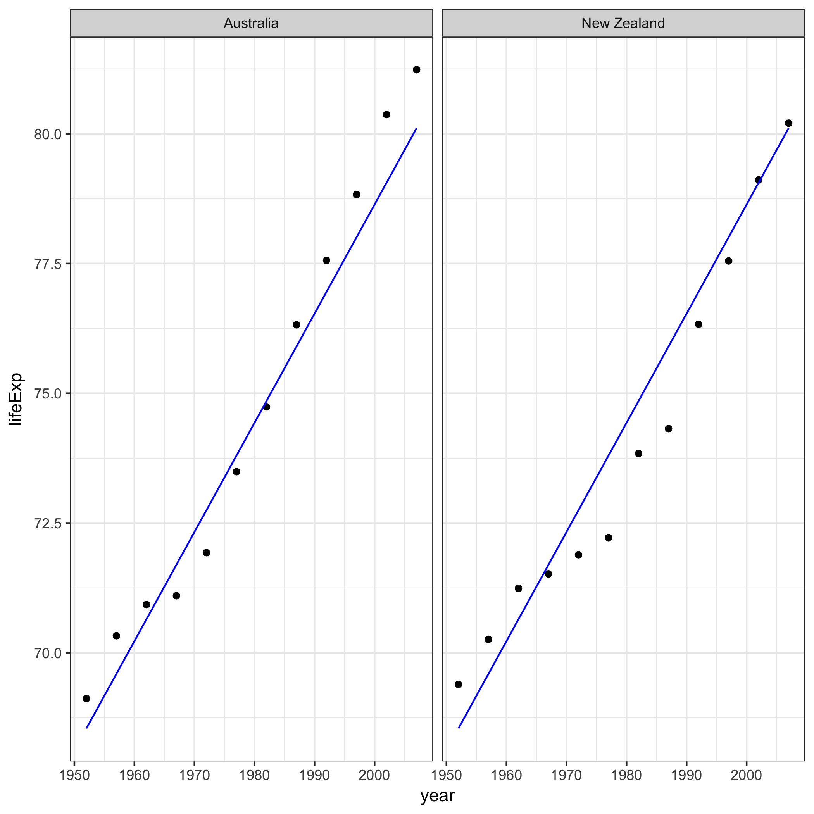
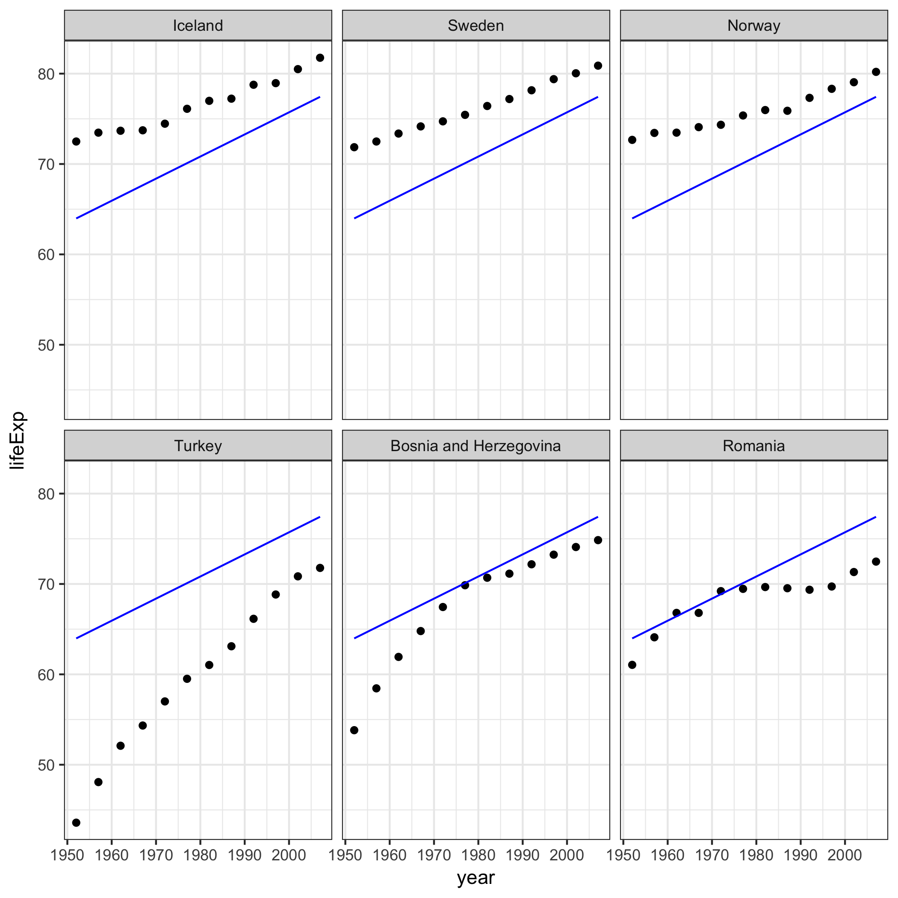
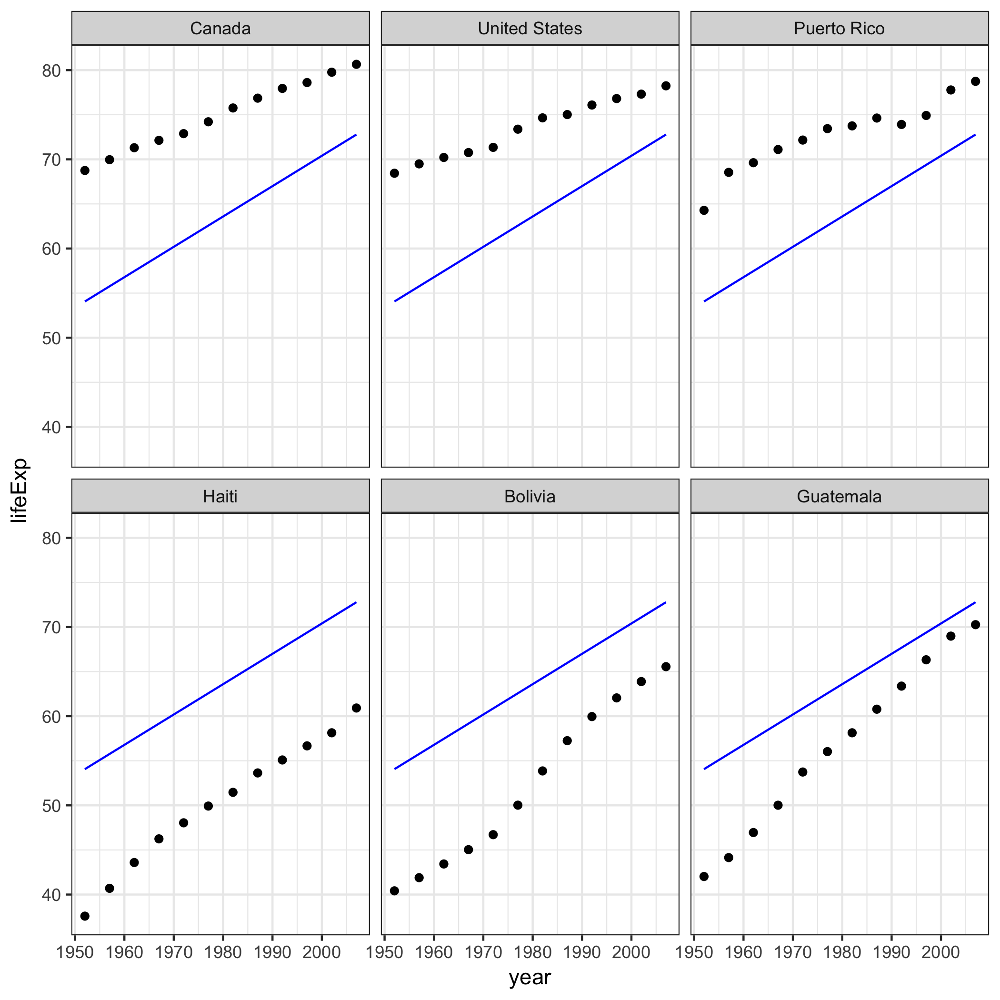
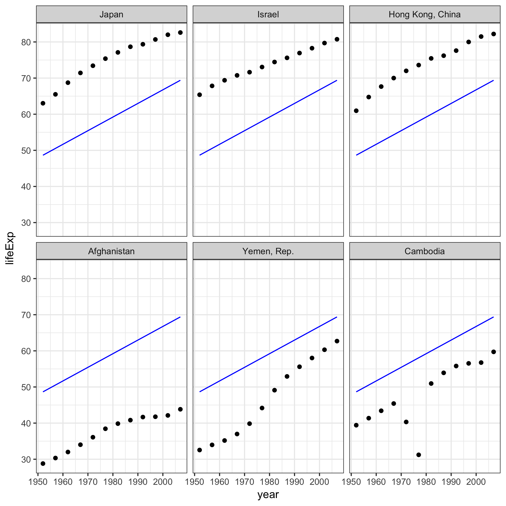
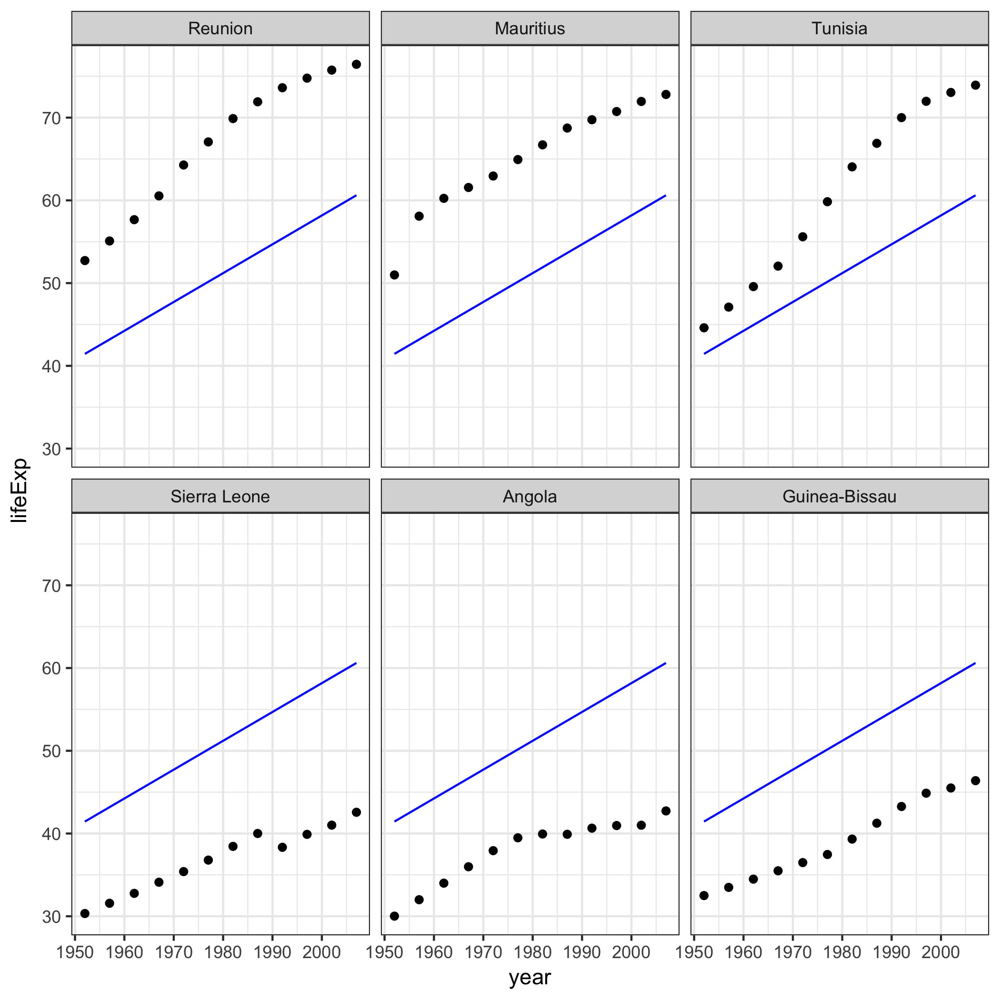

# Automating Data Analysis Pipelines

Link to [homework instructions](http://stat545.com/hw07_automation.html) on STAT 547 website

## Performing exploratory analysis

In the first R script file I create a couple initial plots of gapminder data on life expectancy over time.

This figure shows each continent separately, so that we can see the details and variation.

This graph shows all the continents on the same plot so that we can better compare the continents to each other.

For details on how I created these, see the [first R script](https://github.com/vanflad/STAT547-hw-fladmark-vanessa/blob/master/Homework%207/hw07-1.R) file of the pipeline!

## Perform statistical analysis

I used a for loop to generate linear models for each of the continents and then compiled the results in a table.

I also did further data manipulation to be written out of and read into the next file. See [R script #2](https://github.com/vanflad/STAT547-hw-fladmark-vanessa/blob/master/Homework%207/hw07-2.R) for details, this is just the simple overview with the pretty graphs and tables!

## Generate figures

I created an additional table to display the top 3 and worst 3 countries in each continent for mean life expectancy.

### Best and Worst Countries for Life Expectancy by Continent

As the homework requested, I created five graphs, one for each continent, with countries facet wrapped (I chose the top 3 and bottom 3 as indicated in the table) and fit the linear model to each of the graphs.

See the [third R script](https://github.com/vanflad/STAT547-hw-fladmark-vanessa/blob/master/Homework%207/hw07-3.R) for details on the graphs or fancy pants tables!

Oceania only has two countries in it and they both have incrediby high life expectancy!

We see that the countries with the highest life expectancy in Europe are some of the northern countries and Turkey has historically had incredibly low expectancy in comparison, especially back in the 1950's!

Here the graph informs us that we live in the best country in North and South America for life expectancy, yay health care!! It's interesting to see the stark contrast of very high and very low life expectancies within the same continent, the countries that rank lower are usually less developed countries such as Haiti.

Asia is also an incredibly interesting graph to compare countries, I had no idea that Israel had such a high life expectancy, although I knew Japan's was very high. Afghanistan's life expectancy has plateaued when it should be increasing according to the regression model and this is because of the war currently going on in that country. Also, Cambodia also had a war in the 1970's as can be seen by the crazy data point drop! I had to google what happened that was so drastic to create that break in the trend and it was a full on [genocide.](https://en.wikipedia.org/wiki/Cambodian_genocide)

Honestly, I'm not familiar enough with Africa to know any of these countries but I searched [Reunion](https://en.wikipedia.org/wiki/R%C3%A9union) and it's a tiny island country off the coast of Madagascar with two volcanoes which seems pretty cool!

## Automate the pipeline

The last and [final R script](https://github.com/vanflad/STAT547-hw-fladmark-vanessa/blob/master/Homework%207/hw07-master.R) ran the first three R scripts, rendered this document to github and removed all the excess files floating around the folder!

## Troubleshooting/Links

* How to use [R to automate](https://github.com/STAT545-UBC/STAT545-UBC.github.io/blob/master/automation10_holding-area/01_automation-example_just-r/Makefile.R) because Make is just too hard!
* Reminder how to jitter points for the colorful all-continent graph because I always forget that it's [position="jitter"](http://ggplot2.tidyverse.org/reference/geom_jitter.html) for ggplot not method="jitter" like in base-R
* Jenny Bryan explaining the error I was getting when I tried to run [fct_reorder](https://github.com/STAT545-UBC/Discussion/issues/488) over a dataframe and that I should create a vector of the new printed levels and *then* reorder accordingly
* I always get response and explanitory variable mixed up in linear models and so I went to my other course Biol 501's webpage where they have "R tips" on [linear models](https://www.zoology.ubc.ca/~schluter/R/fit-model/)
* How to use [broom](https://github.com/tidyverse/broom) to make outputs from linear models nice!
* How I make my knitr::kable tables so flawless with the package [kableExtra!](https://haozhu233.github.io/kableExtra/awesome_table_in_pdf.pdf)
* How to [add a linear model to a plot](https://stackoverflow.com/questions/15633714/adding-a-regression-line-on-a-ggplot) without using `geom_smooth(method="lm")` since we want it by entire continent not fit to each of the facetted countries!
*And that's about it for this one, I found some parts tricky (fct_reorder was the bane of my existence for a few hours) and the entire thing time consuming (as always!)
*What I especially didn't like was that I couldn't get the second table to say "Table 2:..." in the caption because kable_as_image always saves it as "Table 1:..." because there's only one table being saved at a time but if you integrate this method straight into RMarkdown, it will have the correct numbering system!