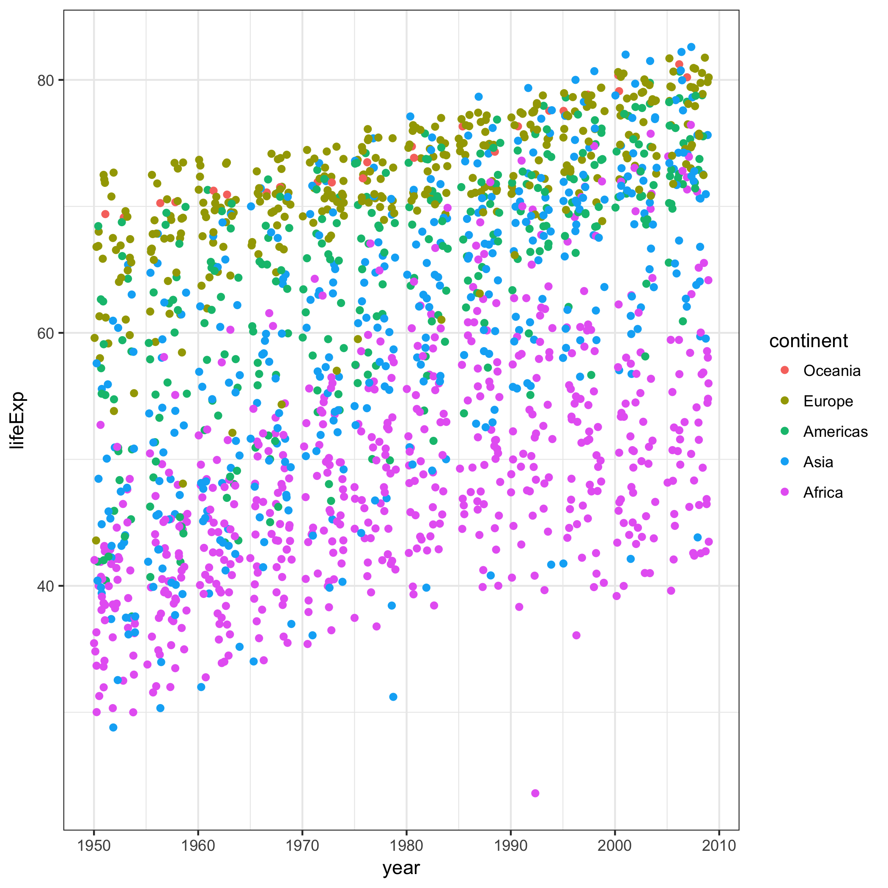

# Automating Data Analysis Pipelines

Link to [homework instructions](http://stat545.com/hw07_automation.html) on STAT 547 website

## Performing exploratory analysis

In the first R script file I create a couple initial plots of gapminder data on life expectancy over time.

This figure shows each continent separately, so that we can see the details and variation.

This graph shows all the continents on the same plot so that we can better compare the continents to each other.

For details on how I created these, see the [first R script](https://github.com/vanflad/STAT547-hw-fladmark-vanessa/blob/master/Homework%207/hw07-1.R) file of the pipeline!

## Perform statistical analysis

I used a for loop to generate linear models for each of the continents and then compiled the results in a table.

I also did further data manipulation to be written out of and read into the next file. See [R script #2](https://github.com/vanflad/STAT547-hw-fladmark-vanessa/blob/master/Homework%207/hw07-2.R) for details, this is just the simple overview with the pretty graphs and tables!

## Generate figures

I created an additional table to display the top 3 and worst 3 countries in each continent for mean life expectancy.

### Best and Worst Countries for Life Expectancy by Continent

## Automate the pipeline

## Troubleshooting/Links

* 