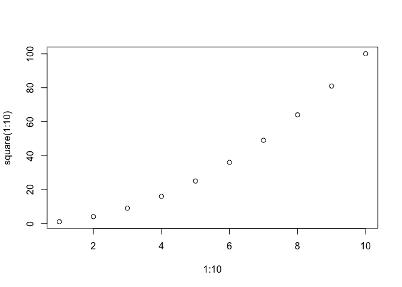
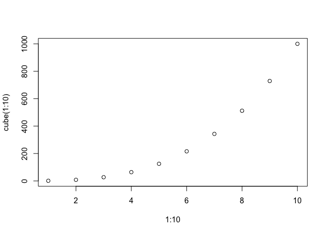
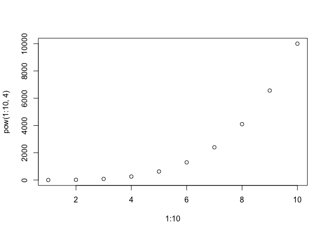
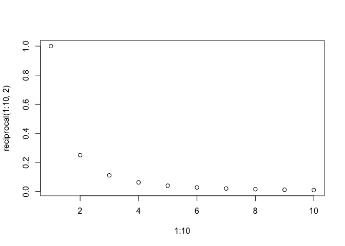

Powers Vignette
================
Vanessa Fladmark
2017-11-28

Powers
------

The goal of powers is to calculate the exponential power of a number! There are a variety of functions to choose from, such as `square()`, `cube()`, `reciprocal()` and `pow()` for calculating to the power of two, the power of three, the inverse of a power 1/*X*<sup>*a*</sup> and the power of any given number `a`, respectively.

If you already have devtools installed, you can download my package here:

``` r
devtools::install_github("vanflad/STAT547-hw-fladmark-vanessa", subdir = "Homework 9/Powers")
```

    ## Downloading GitHub repo vanflad/STAT547-hw-fladmark-vanessa@master
    ## from URL https://api.github.com/repos/vanflad/STAT547-hw-fladmark-vanessa/zipball/master

    ## Installing Powers

    ## '/Library/Frameworks/R.framework/Resources/bin/R' --no-site-file  \
    ##   --no-environ --no-save --no-restore --quiet CMD INSTALL  \
    ##   '/private/var/folders/jg/fx3473r119s8l9gc9jtzm_n00000gn/T/RtmpghFegF/devtools5ae52349b504/vanflad-STAT547-hw-fladmark-vanessa-e274583/Homework  \
    ##   9/Powers'  \
    ##   --library='/Library/Frameworks/R.framework/Versions/3.4/Resources/library'  \
    ##   --install-tests

    ## 

    ## Reloading installed Powers

    ## 
    ## Attaching package: 'Powers'

    ## The following objects are masked _by_ '.GlobalEnv':
    ## 
    ##     cube, pow, reciprocal, square

``` r
library(Powers)
```

Example
-------

Here are some basic examples which shows you how to solve common power calculations:

``` r
pow(-2, 4)
```

    ## [1] 16

``` r
square(1:10)
```

    ##  [1]   1   4   9  16  25  36  49  64  81 100

``` r
cube(-5)
```

    ## [1] -125

``` r
reciprocal(-2, 3)
```

    ## [1] -0.125

Figures
-------

The figures show numbers 1 through 10 and what some common exponential power transformations of that vector look like when displayed visually.

``` r
plot(1:10, square(1:10))
plot(1:10, cube(1:10))
plot(1:10, pow(1:10, 4))
plot(1:10, reciprocal(1:10, 2))
```


