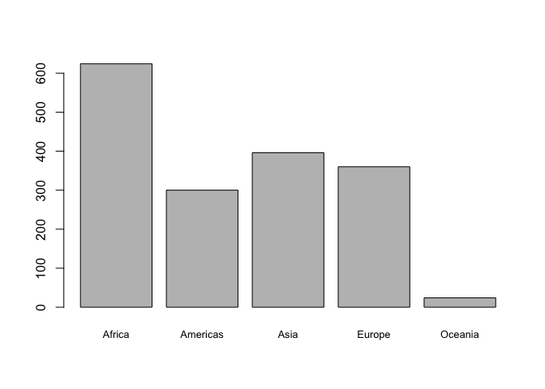
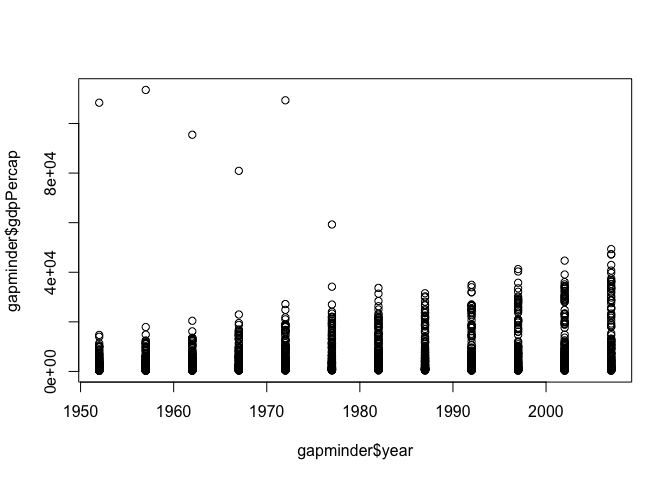
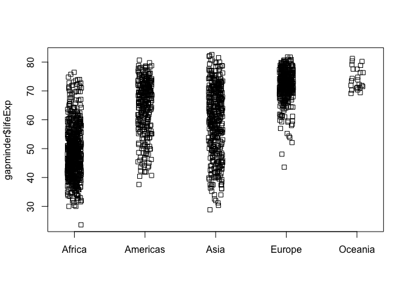
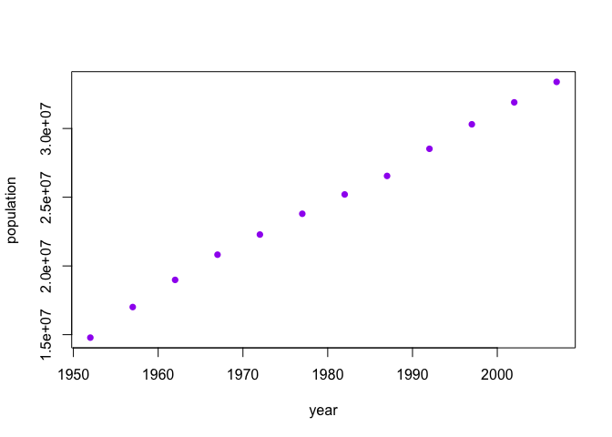
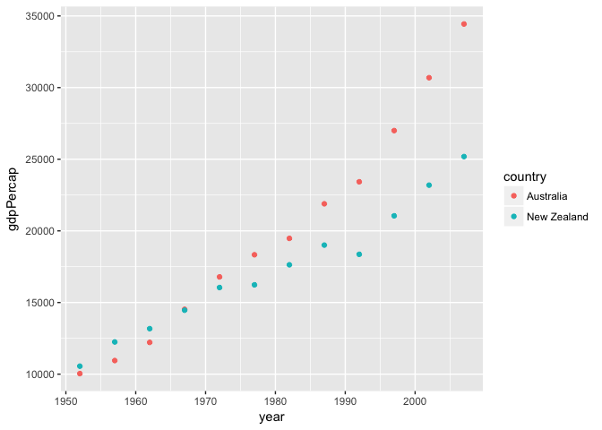
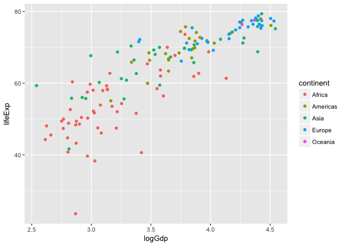
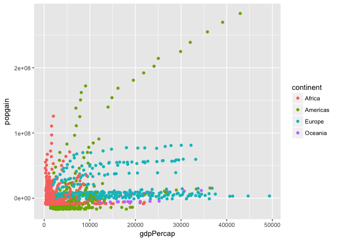

hw02
================

Homework Assignment 2
=====================

September 26, 2017
------------------

### Exploring Gapminder!

#### Bringing rectangular data in

``` r
library(gapminder)
library(tidyverse)
```

    ## Loading tidyverse: ggplot2
    ## Loading tidyverse: tibble
    ## Loading tidyverse: tidyr
    ## Loading tidyverse: readr
    ## Loading tidyverse: purrr
    ## Loading tidyverse: dplyr

    ## Conflicts with tidy packages ----------------------------------------------

    ## filter(): dplyr, stats
    ## lag():    dplyr, stats

#### "Smell testing" the data

``` r
is.data.frame(gapminder)
```

    ## [1] TRUE

``` r
is.matrix(gapminder)
```

    ## [1] FALSE

``` r
is.vector(gapminder)
```

    ## [1] FALSE

``` r
is.list(gapminder)
```

    ## [1] TRUE

Gapminder is a dataframe and a list but not a matrix or vector

``` r
class(gapminder)
```

    ## [1] "tbl_df"     "tbl"        "data.frame"

Gapminder's class is a dataframe but also a "tibble"

``` r
ncol(gapminder)
```

    ## [1] 6

There are 6 columns/variables in the gapminder dataframe

``` r
nrow(gapminder)
```

    ## [1] 1704

There are 1,704 observations/rows within gapminder

``` r
str(gapminder)
```

    ## Classes 'tbl_df', 'tbl' and 'data.frame':    1704 obs. of  6 variables:
    ##  $ country  : Factor w/ 142 levels "Afghanistan",..: 1 1 1 1 1 1 1 1 1 1 ...
    ##  $ continent: Factor w/ 5 levels "Africa","Americas",..: 3 3 3 3 3 3 3 3 3 3 ...
    ##  $ year     : int  1952 1957 1962 1967 1972 1977 1982 1987 1992 1997 ...
    ##  $ lifeExp  : num  28.8 30.3 32 34 36.1 ...
    ##  $ pop      : int  8425333 9240934 10267083 11537966 13079460 14880372 12881816 13867957 16317921 22227415 ...
    ##  $ gdpPercap: num  779 821 853 836 740 ...

The str( ) function can give the above information in one command! It also displays the data type of each variable where: country and continent are factors, year and population are integers, and life expectancy and gdp per capita are numbers

``` r
as_tibble(gapminder) #columns, rows, data types
```

    ## # A tibble: 1,704 x 6
    ##        country continent  year lifeExp      pop gdpPercap
    ##         <fctr>    <fctr> <int>   <dbl>    <int>     <dbl>
    ##  1 Afghanistan      Asia  1952  28.801  8425333  779.4453
    ##  2 Afghanistan      Asia  1957  30.332  9240934  820.8530
    ##  3 Afghanistan      Asia  1962  31.997 10267083  853.1007
    ##  4 Afghanistan      Asia  1967  34.020 11537966  836.1971
    ##  5 Afghanistan      Asia  1972  36.088 13079460  739.9811
    ##  6 Afghanistan      Asia  1977  38.438 14880372  786.1134
    ##  7 Afghanistan      Asia  1982  39.854 12881816  978.0114
    ##  8 Afghanistan      Asia  1987  40.822 13867957  852.3959
    ##  9 Afghanistan      Asia  1992  41.674 16317921  649.3414
    ## 10 Afghanistan      Asia  1997  41.763 22227415  635.3414
    ## # ... with 1,694 more rows

``` r
head(gapminder) #columns, data types
```

    ## # A tibble: 6 x 6
    ##       country continent  year lifeExp      pop gdpPercap
    ##        <fctr>    <fctr> <int>   <dbl>    <int>     <dbl>
    ## 1 Afghanistan      Asia  1952  28.801  8425333  779.4453
    ## 2 Afghanistan      Asia  1957  30.332  9240934  820.8530
    ## 3 Afghanistan      Asia  1962  31.997 10267083  853.1007
    ## 4 Afghanistan      Asia  1967  34.020 11537966  836.1971
    ## 5 Afghanistan      Asia  1972  36.088 13079460  739.9811
    ## 6 Afghanistan      Asia  1977  38.438 14880372  786.1134

``` r
dim(gapminder) #columns and rows
```

    ## [1] 1704    6

``` r
names(gapminder) #columns
```

    ## [1] "country"   "continent" "year"      "lifeExp"   "pop"       "gdpPercap"

``` r
length(gapminder) #columns
```

    ## [1] 6

``` r
summary(gapminder) #columns
```

    ##         country        continent        year         lifeExp     
    ##  Afghanistan:  12   Africa  :624   Min.   :1952   Min.   :23.60  
    ##  Albania    :  12   Americas:300   1st Qu.:1966   1st Qu.:48.20  
    ##  Algeria    :  12   Asia    :396   Median :1980   Median :60.71  
    ##  Angola     :  12   Europe  :360   Mean   :1980   Mean   :59.47  
    ##  Argentina  :  12   Oceania : 24   3rd Qu.:1993   3rd Qu.:70.85  
    ##  Australia  :  12                  Max.   :2007   Max.   :82.60  
    ##  (Other)    :1632                                                
    ##       pop              gdpPercap       
    ##  Min.   :6.001e+04   Min.   :   241.2  
    ##  1st Qu.:2.794e+06   1st Qu.:  1202.1  
    ##  Median :7.024e+06   Median :  3531.8  
    ##  Mean   :2.960e+07   Mean   :  7215.3  
    ##  3rd Qu.:1.959e+07   3rd Qu.:  9325.5  
    ##  Max.   :1.319e+09   Max.   :113523.1  
    ## 

Some alternatives to find number of columns or number of rows, as well as the different data types of the variables, summary could be very useful if you need max, mins and/or means

#### Exploring individual variables

##### Starting with a categorical variable (continent)

``` r
levels(gapminder$continent)
```

    ## [1] "Africa"   "Americas" "Asia"     "Europe"   "Oceania"

There are five possible values for the different continents

``` r
summary(gapminder$continent)
```

    ##   Africa Americas     Asia   Europe  Oceania 
    ##      624      300      396      360       24

``` r
table(gapminder$continent) #another command, exact same result
```

    ## 
    ##   Africa Americas     Asia   Europe  Oceania 
    ##      624      300      396      360       24

Summary( ) shows how frequently each variable appears in dataset Where Africa has the most observations and Oceania the least

``` r
barplot(summary(gapminder$continent), cex.names=0.8)
```



A visualization of the same information the summary table gave

##### Then a quantitative variable (life expectancy)

``` r
summary(gapminder$lifeExp)
```

    ##    Min. 1st Qu.  Median    Mean 3rd Qu.    Max. 
    ##   23.60   48.20   60.71   59.47   70.85   82.60

For numerical data, summary( ) shows min, median, mean, max, etc.

``` r
hist(gapminder$lifeExp)
```


Visual representation of numerical data is a frequency histogram, displays same info as summary but is easier to see distribution

#### Exploring various plot types

##### Scatterplot (two quantitative variables)

``` r
plot(gapminder$year, gapminder$gdpPercap)
```



From this scatterplot we can see that GDP per capita is increasing (with the exception of a few outliers in the earlier years)

##### Plotting one quantitative variable

``` r
ggplot(gapminder, aes(x=lifeExp)) + geom_density()
```


Density plot, which is a smoothed version of the above histogram!

##### Stripchart (one quantitative, one categorical variable)

``` r
stripchart(gapminder$lifeExp ~ gapminder$continent, vertical=TRUE, method="jitter", jitter=0.1)
```



Made a stripchart instead of a boxplot since I couldn't get the variable names to fit! But as we saw in class, sometimes this data display can be more informative since it includes all data points.

#### Using filter( ), select( ) and %&gt;%

``` r
myplot <- gapminder %>%
  filter(country=="Canada") %>%
  select(year, pop)
plot(myplot, xlab = "year", ylab = "population", col = "purple", pch = 16)
```



Utilized filter( ), select( ) and %&gt;% to create a plot showing how Canada's population is increasing over time!

``` r
gapminder %>%
  filter(continent=="Oceania") %>% 
  select(country, year, gdpPercap) %>% 
  ggplot(aes(x=year, y=gdpPercap)) %>% 
  + geom_point(aes(color=country))
```



Fancy graph made by piping into ggplot and using many features!

#### Even more!

``` r
filter(gapminder, country == c("Rwanda", "Afghanistan"))
```

    ## # A tibble: 12 x 6
    ##        country continent  year lifeExp      pop gdpPercap
    ##         <fctr>    <fctr> <int>   <dbl>    <int>     <dbl>
    ##  1 Afghanistan      Asia  1957  30.332  9240934  820.8530
    ##  2 Afghanistan      Asia  1967  34.020 11537966  836.1971
    ##  3 Afghanistan      Asia  1977  38.438 14880372  786.1134
    ##  4 Afghanistan      Asia  1987  40.822 13867957  852.3959
    ##  5 Afghanistan      Asia  1997  41.763 22227415  635.3414
    ##  6 Afghanistan      Asia  2007  43.828 31889923  974.5803
    ##  7      Rwanda    Africa  1952  40.000  2534927  493.3239
    ##  8      Rwanda    Africa  1962  43.000  3051242  597.4731
    ##  9      Rwanda    Africa  1972  44.600  3992121  590.5807
    ## 10      Rwanda    Africa  1982  46.218  5507565  881.5706
    ## 11      Rwanda    Africa  1992  23.599  7290203  737.0686
    ## 12      Rwanda    Africa  2002  43.413  7852401  785.6538

The code did not succeed in showing all values for Rwanda and Afghanistan but rather only half the data because no year is repeated, as it should be, showing all years for each region

``` r
filter(gapminder, country == "Rwanda" | country == "Afghanistan")
```

    ## # A tibble: 24 x 6
    ##        country continent  year lifeExp      pop gdpPercap
    ##         <fctr>    <fctr> <int>   <dbl>    <int>     <dbl>
    ##  1 Afghanistan      Asia  1952  28.801  8425333  779.4453
    ##  2 Afghanistan      Asia  1957  30.332  9240934  820.8530
    ##  3 Afghanistan      Asia  1962  31.997 10267083  853.1007
    ##  4 Afghanistan      Asia  1967  34.020 11537966  836.1971
    ##  5 Afghanistan      Asia  1972  36.088 13079460  739.9811
    ##  6 Afghanistan      Asia  1977  38.438 14880372  786.1134
    ##  7 Afghanistan      Asia  1982  39.854 12881816  978.0114
    ##  8 Afghanistan      Asia  1987  40.822 13867957  852.3959
    ##  9 Afghanistan      Asia  1992  41.674 16317921  649.3414
    ## 10 Afghanistan      Asia  1997  41.763 22227415  635.3414
    ## # ... with 14 more rows

This is the proper way to do it to obtain all 24 rows of data!

``` r
knitr::kable(filter(gapminder, country == "Rwanda" | country == "Afghanistan"))
```

| country     | continent |  year|  lifeExp|       pop|  gdpPercap|
|:------------|:----------|-----:|--------:|---------:|----------:|
| Afghanistan | Asia      |  1952|   28.801|   8425333|   779.4453|
| Afghanistan | Asia      |  1957|   30.332|   9240934|   820.8530|
| Afghanistan | Asia      |  1962|   31.997|  10267083|   853.1007|
| Afghanistan | Asia      |  1967|   34.020|  11537966|   836.1971|
| Afghanistan | Asia      |  1972|   36.088|  13079460|   739.9811|
| Afghanistan | Asia      |  1977|   38.438|  14880372|   786.1134|
| Afghanistan | Asia      |  1982|   39.854|  12881816|   978.0114|
| Afghanistan | Asia      |  1987|   40.822|  13867957|   852.3959|
| Afghanistan | Asia      |  1992|   41.674|  16317921|   649.3414|
| Afghanistan | Asia      |  1997|   41.763|  22227415|   635.3414|
| Afghanistan | Asia      |  2002|   42.129|  25268405|   726.7341|
| Afghanistan | Asia      |  2007|   43.828|  31889923|   974.5803|
| Rwanda      | Africa    |  1952|   40.000|   2534927|   493.3239|
| Rwanda      | Africa    |  1957|   41.500|   2822082|   540.2894|
| Rwanda      | Africa    |  1962|   43.000|   3051242|   597.4731|
| Rwanda      | Africa    |  1967|   44.100|   3451079|   510.9637|
| Rwanda      | Africa    |  1972|   44.600|   3992121|   590.5807|
| Rwanda      | Africa    |  1977|   45.000|   4657072|   670.0806|
| Rwanda      | Africa    |  1982|   46.218|   5507565|   881.5706|
| Rwanda      | Africa    |  1987|   44.020|   6349365|   847.9912|
| Rwanda      | Africa    |  1992|   23.599|   7290203|   737.0686|
| Rwanda      | Africa    |  1997|   36.087|   7212583|   589.9445|
| Rwanda      | Africa    |  2002|   43.413|   7852401|   785.6538|
| Rwanda      | Africa    |  2007|   46.242|   8860588|   863.0885|

Presenting the table in a nicer way using knitr::kable( )

``` r
gapminder %>%
  filter(year == 1992) %>%
  mutate(logGdp = log10(gdpPercap)) %>% 
  select(continent, lifeExp, logGdp) %>% 
  ggplot(aes(x=logGdp, y=lifeExp)) %>% 
  +geom_point(aes(color=continent))
```



Another, more detailed ggplot graph using an extra dplyr feature.

``` r
gapminder %>%
  group_by(continent) %>% 
  select(continent, year, pop, gdpPercap) %>% 
  mutate(popgain = pop - first(pop)) %>% 
  filter(continent != "Asia") %>% 
  ggplot(aes(x=gdpPercap, y=popgain)) %>% 
  +geom_point(aes(color=continent))
```



More experimenting with graphs to investigate groupby( ) and to properly use the mutate( ) and first( ) dplyr functions. The graph shows sometimes population increases without gdp per capita (Africa) or vice versa that gdp per capita can grow without population increasing (Europe) or both can increase simultaneously (Americas) and Asia was not included since the scale was a lot larger and it lost the detail of the other four continents.
