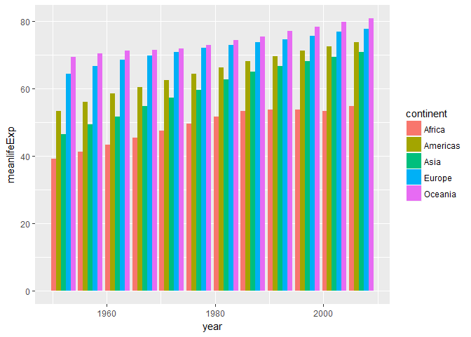

HW04
================

Homework 4
==========

October 10th, 2017
------------------

### Part 1: Data reshaping

#### Prompt choice: Activity 3

Compute some measure of life expectancy for all possible combinations of continent and year then reshape!

``` r
library(tidyverse)
```

    ## Loading tidyverse: ggplot2
    ## Loading tidyverse: tibble
    ## Loading tidyverse: tidyr
    ## Loading tidyverse: readr
    ## Loading tidyverse: purrr
    ## Loading tidyverse: dplyr

    ## Conflicts with tidy packages ----------------------------------------------

    ## filter(): dplyr, stats
    ## lag():    dplyr, stats

``` r
library(gapminder)
```

    ## Warning: package 'gapminder' was built under R version 3.4.2

First step is always to load the relevant libraries!

``` r
mydata <- gapminder %>%
  group_by(continent, year) %>%
  summarize(meanlifeExp=mean(lifeExp))
```

Second step is to summarize the data to compute the mean.

``` r
mydata %>%
  ggplot(aes(year, meanlifeExp))+
  geom_bar(stat="identity", aes(fill=continent), position="dodge")
```



A graph with the initial grouped data before reshaping, showing change in life expectancy mean over time.

``` r
yeardata <- mydata %>%
  spread(key = "continent", value = "meanlifeExp")
knitr::kable(yeardata, format="markdown")
```

|  year|    Africa|  Americas|      Asia|    Europe|  Oceania|
|-----:|---------:|---------:|---------:|---------:|--------:|
|  1952|  39.13550|  53.27984|  46.31439|  64.40850|  69.2550|
|  1957|  41.26635|  55.96028|  49.31854|  66.70307|  70.2950|
|  1962|  43.31944|  58.39876|  51.56322|  68.53923|  71.0850|
|  1967|  45.33454|  60.41092|  54.66364|  69.73760|  71.3100|
|  1972|  47.45094|  62.39492|  57.31927|  70.77503|  71.9100|
|  1977|  49.58042|  64.39156|  59.61056|  71.93777|  72.8550|
|  1982|  51.59287|  66.22884|  62.61794|  72.80640|  74.2900|
|  1987|  53.34479|  68.09072|  64.85118|  73.64217|  75.3200|
|  1992|  53.62958|  69.56836|  66.53721|  74.44010|  76.9450|
|  1997|  53.59827|  71.15048|  68.02052|  75.50517|  78.1900|
|  2002|  53.32523|  72.42204|  69.23388|  76.70060|  79.7400|
|  2007|  54.80604|  73.60812|  70.72848|  77.64860|  80.7195|

First, a table with a row for each year and mean life expectancy value for each continent.

``` r
contdata <- mydata %>%
  spread(key = "year", value = "meanlifeExp")
knitr::kable(contdata, format="markdown")
```

<table style="width:100%;">
<colgroup>
<col width="8%" />
<col width="7%" />
<col width="7%" />
<col width="7%" />
<col width="7%" />
<col width="7%" />
<col width="7%" />
<col width="7%" />
<col width="7%" />
<col width="7%" />
<col width="7%" />
<col width="7%" />
<col width="7%" />
</colgroup>
<thead>
<tr class="header">
<th align="left">continent</th>
<th align="right">1952</th>
<th align="right">1957</th>
<th align="right">1962</th>
<th align="right">1967</th>
<th align="right">1972</th>
<th align="right">1977</th>
<th align="right">1982</th>
<th align="right">1987</th>
<th align="right">1992</th>
<th align="right">1997</th>
<th align="right">2002</th>
<th align="right">2007</th>
</tr>
</thead>
<tbody>
<tr class="odd">
<td align="left">Africa</td>
<td align="right">39.13550</td>
<td align="right">41.26635</td>
<td align="right">43.31944</td>
<td align="right">45.33454</td>
<td align="right">47.45094</td>
<td align="right">49.58042</td>
<td align="right">51.59287</td>
<td align="right">53.34479</td>
<td align="right">53.62958</td>
<td align="right">53.59827</td>
<td align="right">53.32523</td>
<td align="right">54.80604</td>
</tr>
<tr class="even">
<td align="left">Americas</td>
<td align="right">53.27984</td>
<td align="right">55.96028</td>
<td align="right">58.39876</td>
<td align="right">60.41092</td>
<td align="right">62.39492</td>
<td align="right">64.39156</td>
<td align="right">66.22884</td>
<td align="right">68.09072</td>
<td align="right">69.56836</td>
<td align="right">71.15048</td>
<td align="right">72.42204</td>
<td align="right">73.60812</td>
</tr>
<tr class="odd">
<td align="left">Asia</td>
<td align="right">46.31439</td>
<td align="right">49.31854</td>
<td align="right">51.56322</td>
<td align="right">54.66364</td>
<td align="right">57.31927</td>
<td align="right">59.61056</td>
<td align="right">62.61794</td>
<td align="right">64.85118</td>
<td align="right">66.53721</td>
<td align="right">68.02052</td>
<td align="right">69.23388</td>
<td align="right">70.72848</td>
</tr>
<tr class="even">
<td align="left">Europe</td>
<td align="right">64.40850</td>
<td align="right">66.70307</td>
<td align="right">68.53923</td>
<td align="right">69.73760</td>
<td align="right">70.77503</td>
<td align="right">71.93777</td>
<td align="right">72.80640</td>
<td align="right">73.64217</td>
<td align="right">74.44010</td>
<td align="right">75.50517</td>
<td align="right">76.70060</td>
<td align="right">77.64860</td>
</tr>
<tr class="odd">
<td align="left">Oceania</td>
<td align="right">69.25500</td>
<td align="right">70.29500</td>
<td align="right">71.08500</td>
<td align="right">71.31000</td>
<td align="right">71.91000</td>
<td align="right">72.85500</td>
<td align="right">74.29000</td>
<td align="right">75.32000</td>
<td align="right">76.94500</td>
<td align="right">78.19000</td>
<td align="right">79.74000</td>
<td align="right">80.71950</td>
</tr>
</tbody>
</table>

Second, the other way around, a table with a row for each continent and mean life expectancy value for each year!

I genuinely can't think of an appropriate plot that is easier to make given the reshaped dataset. This is due to my previous experience working with large datasets and finding creative ways to work with those and not yet having experience in plotting reshaped and manipulated datasets, which I'm sure we will cover in future classes!

### Part 2: Join, merge, look up

#### Prompt choice: Activity 2

Create own cheatsheet on how to use join's on the pets I've owned.

``` r
library(readr)

pets <- "
name, breed, color
Sheba, Mutt, black
Precious, Chesapeake-lab, black
Vinnie, Chocolate lab, brown
Dude, American longhair, orange
Angel, American shorthair, orange(calico)
Princess, American shorthair, orange(calico)
Cheezy, American shorthair, orange(tortoiseshell)
Loki, American longhair, white
Misty, American shorthair, grey(tabby)
Goldeen, Goldfish, orange
Swordie, Swordtail, grey
"
pets <- read_csv(pets, trim_ws = TRUE, skip = 1)

breeds <- "
animal, breed, fur
dog, Chesapeake-lab, short
dog, Chocolate lab, short
cat, American longhair, long
cat, American shorthair, short
fish, Goldfish, none
fish, Swordtail, none
fish, Guppy, none
"
breeds <- read_csv(breeds, trim_ws = TRUE, skip = 1)
```

First load the library and the two relevant dataframe files.

I will be modelling this "cheatsheet" after Jenny's, utilizing the same variations of inner\_join( ), left\_join( ), full\_join( ), semi\_join( ) and anti\_join( ) and investigating the order in which you attach the dataframes (i.e. "pets" first versus "breeds" first) since these are all the possible iterations of "join" to explore.

Note: right\_join( ) is another join function in dplyr but it has the opposite effect of left\_join( ) and since order of dataframes is alternated, right\_join( ) is omitted here for simplicity.

##### inner\_join(pets, breeds)

``` r
ijpb <- inner_join(pets, breeds, by="breed")
knitr::kable(ijpb, format="markdown")
```

| name     | breed              | color                 | animal | fur   |
|:---------|:-------------------|:----------------------|:-------|:------|
| Precious | Chesapeake-lab     | black                 | dog    | short |
| Vinnie   | Chocolate lab      | brown                 | dog    | short |
| Dude     | American longhair  | orange                | cat    | long  |
| Angel    | American shorthair | orange(calico)        | cat    | short |
| Princess | American shorthair | orange(calico)        | cat    | short |
| Cheezy   | American shorthair | orange(tortoiseshell) | cat    | short |
| Loki     | American longhair  | white                 | cat    | long  |
| Misty    | American shorthair | grey(tabby)           | cat    | short |
| Goldeen  | Goldfish           | orange                | fish   | none  |
| Swordie  | Swordtail          | grey                  | fish   | none  |

Inner join is a mutating join that returns all rows of x (pets) where there are matching values in y (breeds) and all columns.

We see here that my dog Sheba disappears because there is no breed information for "mutts" of unknown origin in the breeds dataframe.

##### semi\_join(pets, breeds)

``` r
sjpb<- semi_join(pets, breeds, by="breed")
knitr::kable(sjpb, format="markdown")
```

| name     | breed              | color                 |
|:---------|:-------------------|:----------------------|
| Precious | Chesapeake-lab     | black                 |
| Vinnie   | Chocolate lab      | brown                 |
| Dude     | American longhair  | orange                |
| Angel    | American shorthair | orange(calico)        |
| Princess | American shorthair | orange(calico)        |
| Cheezy   | American shorthair | orange(tortoiseshell) |
| Loki     | American longhair  | white                 |
| Misty    | American shorthair | grey(tabby)           |
| Goldeen  | Goldfish           | orange                |
| Swordie  | Swordtail          | grey                  |

Semi join is a filtering join that returns all rows of x (pets) where there are matching values in y (breeds), and only x columns.

It is similar to the previous inner join but omitting the columns of y (animal, fur) and only returning columns of x (name, color).

Note: in Jenny's example, her row order had changed but mine have not in this case, so just keep in mind order changes *sometimes*.

##### left\_join(pets, breeds)

``` r
ljpb<- left_join(pets, breeds, by="breed")
knitr::kable(ljpb, format="markdown")
```

| name     | breed              | color                 | animal | fur   |
|:---------|:-------------------|:----------------------|:-------|:------|
| Sheba    | Mutt               | black                 | NA     | NA    |
| Precious | Chesapeake-lab     | black                 | dog    | short |
| Vinnie   | Chocolate lab      | brown                 | dog    | short |
| Dude     | American longhair  | orange                | cat    | long  |
| Angel    | American shorthair | orange(calico)        | cat    | short |
| Princess | American shorthair | orange(calico)        | cat    | short |
| Cheezy   | American shorthair | orange(tortoiseshell) | cat    | short |
| Loki     | American longhair  | white                 | cat    | long  |
| Misty    | American shorthair | grey(tabby)           | cat    | short |
| Goldeen  | Goldfish           | orange                | fish   | none  |
| Swordie  | Swordtail          | grey                  | fish   | none  |

Left join is a mutating join that returns all rows from x (pets) and all columns from both dataframes x (pets) and y (breeds).

We can see that all values of x are present with the row for Sheba having filled in NA values, since there is no corresponding data in breeds for mutts even though she was indeed a short haired dog.

##### anti\_join(pets, breeds)

``` r
ajpb<- anti_join(pets, breeds, by="breed")
knitr::kable(ajpb, format="markdown")
```

| name  | breed | color |
|:------|:------|:------|
| Sheba | Mutt  | black |

Anti join is a filtering join that returns all rows of x where there are no matching values in y, keeping just columns from x.

In this case, it returns Sheba and her info from pets dataframe.

This may be a helpful function to find rows with potential problems or NAs before using the other join functions to prevent the row being dropped/omitted without your knowledge of it!

##### inner\_join(breeds, pets)

Now we switch the order of x and y to (breeds, pets) and repeat!

``` r
ijbp<- inner_join(breeds, pets, by="breed")
knitr::kable(ijbp, format="markdown")
```

| animal | breed              | fur   | name     | color                 |
|:-------|:-------------------|:------|:---------|:----------------------|
| dog    | Chesapeake-lab     | short | Precious | black                 |
| dog    | Chocolate lab      | short | Vinnie   | brown                 |
| cat    | American longhair  | long  | Dude     | orange                |
| cat    | American longhair  | long  | Loki     | white                 |
| cat    | American shorthair | short | Angel    | orange(calico)        |
| cat    | American shorthair | short | Princess | orange(calico)        |
| cat    | American shorthair | short | Cheezy   | orange(tortoiseshell) |
| cat    | American shorthair | short | Misty    | grey(tabby)           |
| fish   | Goldfish           | none  | Goldeen  | orange                |
| fish   | Swordtail          | none  | Swordie  | grey                  |

Again, inner join is a mutating join, and if there are multiple matches between x and y, all combinations of matches are returned.

What it means by that is that for each breed type found in x, every separate pet classified in that breed in y is returned.

In this example, the order of the rows was rearranged because the cats are now grouped by their breed instead of randomly scattered.

##### semi\_join(breeds, pets)

``` r
sjbp<- semi_join(breeds, pets, by="breed")
knitr::kable(sjbp, format="markdown")
```

| animal | breed              | fur   |
|:-------|:-------------------|:------|
| dog    | Chesapeake-lab     | short |
| dog    | Chocolate lab      | short |
| cat    | American longhair  | long  |
| cat    | American shorthair | short |
| fish   | Goldfish           | none  |
| fish   | Swordtail          | none  |

Reminder: semi join is a filtering join that returns rows from x that have matching values of y but only returns the columns of x.

Therefore it is simply x (breeds, in this case) with the exception of Guppy fish, since I've never owned one and is not in y (pets).

##### left\_join(breeds, pets)

``` r
ljbp<- left_join(breeds, pets, by="breed")
knitr::kable(ljbp, format="markdown")
```

| animal | breed              | fur   | name     | color                 |
|:-------|:-------------------|:------|:---------|:----------------------|
| dog    | Chesapeake-lab     | short | Precious | black                 |
| dog    | Chocolate lab      | short | Vinnie   | brown                 |
| cat    | American longhair  | long  | Dude     | orange                |
| cat    | American longhair  | long  | Loki     | white                 |
| cat    | American shorthair | short | Angel    | orange(calico)        |
| cat    | American shorthair | short | Princess | orange(calico)        |
| cat    | American shorthair | short | Cheezy   | orange(tortoiseshell) |
| cat    | American shorthair | short | Misty    | grey(tabby)           |
| fish   | Goldfish           | none  | Goldeen  | orange                |
| fish   | Swordtail          | none  | Swordie  | grey                  |
| fish   | Guppy              | none  | NA       | NA                    |

Again, left join is a mutating join that returns all rows of x (breeds) and all columns of both x (breeds) and y (pets).

Here, it is similar to inner\_join(breeds,pets) above, but with the addition of the Guppy row with filled in NAs for y (pets) columns.

##### anti\_join(breeds, pets)

``` r
ajbp<- anti_join(breeds, pets, by="breed")
knitr::kable(ajbp, format="markdown")
```

| animal | breed | fur  |
|:-------|:------|:-----|
| fish   | Guppy | none |

Reminder: anti join is a filtering join that returns rows of x that do *not* have matching values in y, and only columns of x.

As before, it returns the often tricky, non-matching rows and its corresponding values, in this case, it is Guppy information data.

##### full\_join(breeds, pets)

This is the final join, where the order of x and y don't matter for the data included (because everything is included) but the order of x and y does matter for the arrangement of the order of the rows and columns.

``` r
fjbp<- full_join(breeds, pets, by="breed")
knitr::kable(fjbp, format="markdown")
```

| animal | breed              | fur   | name     | color                 |
|:-------|:-------------------|:------|:---------|:----------------------|
| dog    | Chesapeake-lab     | short | Precious | black                 |
| dog    | Chocolate lab      | short | Vinnie   | brown                 |
| cat    | American longhair  | long  | Dude     | orange                |
| cat    | American longhair  | long  | Loki     | white                 |
| cat    | American shorthair | short | Angel    | orange(calico)        |
| cat    | American shorthair | short | Princess | orange(calico)        |
| cat    | American shorthair | short | Cheezy   | orange(tortoiseshell) |
| cat    | American shorthair | short | Misty    | grey(tabby)           |
| fish   | Goldfish           | none  | Goldeen  | orange                |
| fish   | Swordtail          | none  | Swordie  | grey                  |
| fish   | Guppy              | none  | NA       | NA                    |
| NA     | Mutt               | NA    | Sheba    | black                 |

Full join is a mutating join that returns all rows and all columns from both x and y and when there are not matching values in the dataframes, NAs are created.

We observe this at the bottom of the above resulting table where the rows with NAs are placed, preceeded by the rows that do have the required matching values.
